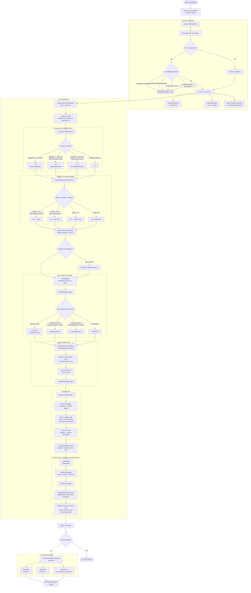

# BodyFuel — Backend

REST API бэкенд фитнес-сервиса **BodyFuel**. Написан на Go, реализует управление тренировками, дневником питания, весом, персонализированными рекомендациями и системой push/email/SMS уведомлений.

---

## Содержание

- [Быстрый старт](#быстрый-старт)
- [Запуск через Docker Compose](#запуск-через-docker-compose)
- [Ручной запуск (без Docker)](#ручной-запуск-без-docker)
- [Конфигурация](#конфигурация)
- [Архитектура](#архитектура)
- [Сервисы](#сервисы)
- [База данных](#база-данных)
- [API Reference](#api-reference)
- [Бизнес-логика](#бизнес-логика)
- [Генерация тренировки — подробная логика](#генерация-тренировки--подробная-логика)
- [Уведомления](#уведомления)
- [AI-интеграция](#ai-интеграция)
- [Подключение внешних сервисов](#подключение-внешних-сервисов)
- [Разработка](#разработка)

---

## Быстрый старт

### Требования

| Инструмент | Версия | Зачем |
|-----------|--------|-------|
| Docker Desktop | ≥ 24 | контейнерное окружение |
| Docker Compose | ≥ 2.20 (входит в Desktop) | оркестрация сервисов |
| Go | ≥ 1.24 | только для локальной разработки без Docker |

---

## Запуск через Docker Compose

### 1. Создать файл секретов

```bash
cp .env.example .env
```

Откройте `.env` и вставьте нужные ключи:

```dotenv
# Обязательно для AI-функций (анализ еды, рекомендации)
OPENAI_API_KEY=sk-...

# Опционально — email-уведомления
SENDGRID_API_KEY=SG....
SENDGRID_FROM_EMAIL=noreply@yourdomain.com
SENDGRID_FROM_NAME=BodyFuel
```

> Без `OPENAI_API_KEY` приложение запустится, но эндпоинты `/nutrition/analyze/upload` и `/nutrition/recipes` будут возвращать ошибку.

### 2. Собрать и поднять

```bash
docker compose up --build
```

Первый запуск скачивает образы и собирает Go-бинарник — занимает 2-3 минуты.

### 3. Что происходит при старте

```
bodyfuel-postgres   → ждёт healthcheck (pg_isready)
bodyfuel-minio      → ждёт healthcheck (curl /minio/health/live)
bodyfuel-redis      → ждёт healthcheck (redis-cli ping)
bodyfuel-minio-init → создаёт bucket avatars + ставит public-read политику
bodyfuel-app        → применяет goose-миграции → поднимает HTTP-сервер
```

### 4. Проверка

| URL | Что |
|-----|-----|
| `http://localhost:8080/swagger/index.html` | Swagger UI |
| `http://localhost:8080/api/v1/health` | Health check |
| `http://localhost:9001` | MinIO Console (minioadmin / minioadmin) |
| `http://localhost:5432` | PostgreSQL (danila / postgres / backend_db) |
| `localhost:6379` | Redis (без пароля) |

```bash
# Быстрый тест — должен вернуть 200
curl -s http://localhost:8080/api/v1/health
```

### 5. Остановка

```bash
docker compose down          # остановить, данные сохраняются в volumes
docker compose down -v       # остановить + удалить volumes (сброс БД и MinIO)
```

### Пересборка после изменений в коде

```bash
docker compose up --build app    # пересобрать только app, postgres/minio не трогать
```

### Просмотр логов

```bash
docker compose logs -f app       # логи приложения
docker compose logs -f postgres  # логи PostgreSQL
docker compose logs app --tail=50
```

---

## Ручной запуск (без Docker)

### 1. Поднять зависимости (PostgreSQL + MinIO + Redis)

Можно использовать часть Compose:

```bash
docker compose up -d postgres minio minio-init redis
```

Или использовать уже запущенные локальные экземпляры.

### 2. Заполнить config/config.yaml

Файл уже содержит значения для локального запуска. Поправьте при необходимости:

```yaml
postgres:
  host: "localhost"
  database: "backend_db"
  user: "danila"
  password: "postgres"

redis:
  addr: "localhost:6379"  # оставьте пустым чтобы отключить кэш

minio:
  endpoint: "http://localhost:9000"
  access_key: "minioadmin"
  secret_key: "minioadmin"

openai:
  api_key: "sk-..."   # вставьте свой ключ
```

> `config/config.yaml` добавлен в `.gitignore` — изменения не попадут в git.

### 3. Применить миграции вручную (опционально)

Приложение применяет миграции само через goose при старте. Но можно запустить вручную:

```bash
go run github.com/pressly/goose/v3/cmd/goose@latest \
  postgres "host=localhost user=danila password=postgres dbname=backend_db sslmode=disable" \
  up -dir ./migrations
```

### 4. Запустить

```bash
go run ./cmd/main.go -config ./config/config.yaml
```

---

## Конфигурация

Полный шаблон — `config/config.yaml.template`. Все параметры можно переопределить переменными окружения.

### Секция `app`

```yaml
app:
  http_server:
    host: "0.0.0.0"          # IP для прослушивания
    port: 8080                 # HTTP-порт API
    api_host: "localhost:8080" # Хост для Swagger (отображается в UI)
    metric_port: 8081          # Порт для метрик Prometheus
    tls: false                 # Включить HTTPS
    cert_path: ""              # Путь к TLS-сертификату
    key_path: ""               # Путь к TLS-ключу
  graceful_timeout: "5s"       # Таймаут graceful shutdown
  tasks_tracking_duration: "13s" # Интервал опроса очереди задач
  workouts_config:
    workout_pull_user_interval: "60s" # Интервал автогенерации тренировок
    limit_generate_workouts: 3        # Лимит авто-тренировок в день
```


### Секция `postgres` — пул соединений

```yaml
postgres:
  host: "localhost"
  database: "backend_db"
  user: "danila"
  password: "postgres"
  max_open_conn: 25       # максимум открытых соединений
  max_idle_conn: 10       # максимум простаивающих соединений
  conn_max_idle_time: "5m"    # время жизни простаивающего соединения
  conn_max_lifetime: "30m"    # максимальное время жизни соединения
```

Переменные окружения (префикс `POSTGRES_`):

| Env var | Поле yaml | По умолчанию |
|---------|-----------|-------------|
| `POSTGRES_HOST` | `host` | `localhost` |
| `POSTGRES_USERNAME` | `user` | `danila` |
| `POSTGRES_PASSWORD` | `password` | `postgres` |
| `POSTGRES_DATABASE` | `database` | `backend_db` |

### Секция `redis` (кэш AI-ответов)

```yaml
redis:
  addr: "localhost:6379"
  password: ""   # пусто если без пароля
  db: 0
```

Redis **опционален**: если `addr` пустой или Redis недоступен — приложение запускается без кэша и все запросы идут напрямую в OpenAI.

Переменные окружения (префикс `REDIS_`):

| Env var | Поле yaml | По умолчанию |
|---------|-----------|-------------|
| `REDIS_ADDR` | `addr` | `localhost:6379` |
| `REDIS_PASSWORD` | `password` | _(пусто)_ |
| `REDIS_DB` | `db` | `0` |

### Секция `minio`

```yaml
minio:
  endpoint: "http://localhost:9000"
  access_key: "minioadmin"
  secret_key: "minioadmin"
  bucket: "avatars"
  region: "us-east-1"
  public_url: "http://localhost:9000/avatars"
  presign_ttl: "5m"
```

Переменные окружения (префикс `MINIO_`):

| Env var | Поле yaml |
|---------|-----------|
| `MINIO_ENDPOINT` | `endpoint` |
| `MINIO_ACCESS_KEY` | `access_key` |
| `MINIO_SECRET_KEY` | `secret_key` |
| `MINIO_BUCKET` | `bucket` |
| `MINIO_REGION` | `region` |
| `MINIO_PUBLIC_URL` | `public_url` |
| `MINIO_PRESIGN_TTL` | `presign_ttl` |

`MINIO_PUBLIC_URL` — это URL, который получают клиенты. В Docker Compose он остаётся `http://localhost:9000/avatars`, чтобы мобильное приложение/браузер могли загрузить фото напрямую.

### Секция `sendgrid` (email)

```yaml
sendgrid:
  api_key: "SG.xxx"
  from_email: "noreply@bodyfuel.app"
  from_name: "BodyFuel"
```

Переменные окружения (префикс `SENDGRID_`): `SENDGRID_API_KEY`, `SENDGRID_FROM_EMAIL`, `SENDGRID_FROM_NAME`.

### Секция `twilio` (SMS)

```yaml
twilio:
  account_sid: "ACxxx"
  auth_token: "xxx"
  from_phone: "+79001234567"
```

Переменные окружения (префикс `TWILIO_`): `TWILIO_ACCOUNT_SID`, `TWILIO_AUTH_TOKEN`, `TWILIO_FROM_PHONE`.

### Секция `apns` (iOS push)

```yaml
apns:
  key_path: "./keys/AuthKey.p8"
  key_id: "XXXXXXXXXX"
  team_id: "XXXXXXXXXX"
  bundle_id: "com.bodyfuel.app"
  sandbox: true
```

Переменные окружения (префикс `APNS_`): `APNS_KEY_PATH`, `APNS_KEY_ID`, `APNS_TEAM_ID`, `APNS_BUNDLE_ID`, `APNS_SANDBOX`.

При запуске в Docker положите `.p8`-файл в папку `keys/` рядом с `docker-compose.yml` и добавьте volume-mount:
```yaml
# в секции app → volumes:
- ./keys:/app/keys:ro
```

### Секция `openai` (AI-функции)

```yaml
openai:
  api_key: "sk-xxx"
```

Переменная окружения: `OPENAI_API_KEY` (рекомендуется передавать через `.env`).

---

## Архитектура

Приложение построено по принципам **Clean Architecture + DDD**. Каждый слой взаимодействует с соседним только через интерфейсы.

```
cmd/
└── main.go                   # Точка входа, swagger-аннотации

internal/
├── app/                      # Сборка приложения (wire-up зависимостей)
├── config/                   # Конфигурационные структуры
├── domain/
│   └── entities/             # Доменные сущности и бизнес-правила
├── dto/                      # Data Transfer Objects (фильтры, спецификации)
├── errors/                   # Доменные ошибки
├── handlers/
│   └── v1/                   # HTTP-хендлеры (Gin), swagger-комментарии
│       └── models/           # Request/Response модели
├── infrastructure/
│   └── repositories/
│       ├── postgres/         # Реализация репозиториев (sqlx + squirrel)
│       │   ├── builders/     # SQL query builders
│       │   └── models/       # DB row-модели
│       └── minio/            # Клиент MinIO (S3)
└── service/
    ├── auth/                 # Аутентификация, токены, верификация
    ├── avatar/               # Presigned URL для аватаров
    ├── crud/                 # CRUD для всех доменных объектов
    ├── executor/             # Фоновый воркер задач
    ├── nutricion/            # Дневник питания, AI-анализ фото
    ├── recomendation/        # Персональные AI-рекомендации
    └── workouts/             # Генерация тренировок

pkg/
├── JWT/                      # Генерация и валидация JWT
├── ai/                       # Клиент OpenAI (Vision + Chat)
├── cache/                    # Redis-клиент (кэш AI-ответов)
├── logging/                  # Структурированное логирование (zerolog)
└── notifications/
    ├── apns/                 # iOS push (APNs HTTP/2)
    ├── sendgrid/             # Email (SendGrid)
    └── twilio/               # SMS (Twilio)
```

---

## Сервисы

| Сервис | Пакет | Описание |
|--------|-------|----------|
| **Auth** | `service/auth` | Регистрация, вход, refresh-токен, верификация email/телефона, сброс пароля |
| **CRUD** | `service/crud` | CRUD для профиля, параметров, веса, упражнений, тренировок, устройств, калорий |
| **Workouts** | `service/workouts` | Генерация персональных тренировок, фоновая автогенерация по расписанию |
| **Executor** | `service/executor` | Фоновый воркер: опрашивает таблицу `tasks` и отправляет email / SMS / push |
| **Nutrition** | `service/nutricion` | Дневник питания, анализ фото через GPT-4o Vision, дневник, отчёты |
| **Recommendations** | `service/recomendation` | Генерация персональных рекомендаций через GPT-4o на основе профиля |
| **Avatar** | `service/avatar` | Presigned PUT URL для загрузки аватара напрямую в MinIO |

---

## База данных

Все таблицы находятся в схеме `bodyfuel`. Миграции применяются автоматически через goose при старте:
- `migrations/00001_init_schema.sql` — полная схема БД (все таблицы, индексы, справочник упражнений)

### `user_info` — аккаунты пользователей

| Колонка | Тип | Описание |
|---------|-----|----------|
| `id` | UUID PK | Идентификатор |
| `username` | TEXT UNIQUE | Никнейм |
| `name` | TEXT | Имя |
| `surname` | TEXT | Фамилия |
| `password` | TEXT | bcrypt-хэш пароля |
| `email` | TEXT UNIQUE | Email |
| `phone` | TEXT | Номер телефона |
| `created_at` | TIMESTAMPTZ | Дата регистрации |
| `email_verified_at` | TIMESTAMPTZ NULL | Время верификации email (NULL = не верифицирован) |
| `phone_verified_at` | TIMESTAMPTZ NULL | Время верификации телефона (NULL = не верифицирован) |

### `user_params` — физические параметры и цели

| Колонка | Тип | Описание |
|---------|-----|----------|
| `id` | UUID PK | Идентификатор |
| `id_user` | UUID FK | → `user_info.id` |
| `height` | INT | Рост (см) |
| `photo` | TEXT | Ключ объекта аватара в MinIO |
| `wants` | ENUM | Цель: `lose_weight`, `build_muscle`, `stay_fit` |
| `lifestyle` | ENUM | Активность: `not_active`, `active`, `sportive` |
| `target_workouts_weeks` | INT | Тренировок в неделю (цель) |
| `target_calories_daily` | INT | Норма калорий в день |
| `target_weight` | FLOAT | Целевой вес (кг) |

### `user_weight` — история веса

| Колонка | Тип | Описание |
|---------|-----|----------|
| `id` | UUID PK | Идентификатор |
| `id_user` | UUID FK | → `user_info.id` |
| `weight` | FLOAT | Вес (кг) |
| `date` | TIMESTAMPTZ | Дата измерения |

### `exercise` — справочник упражнений

| Колонка | Тип | Описание |
|---------|-----|----------|
| `id` | UUID PK | Идентификатор |
| `name` | VARCHAR(100) | Название |
| `description` | TEXT | Описание техники |
| `level_preparation` | ENUM | `beginner`, `medium`, `sportsman` |
| `type_exercise` | ENUM | `cardio`, `upper_body`, `lower_body`, `full_body`, `flexibility` |
| `place_exercise` | ENUM | `home`, `gym`, `street` |
| `base_count_reps` | INT | Базовое число повторений (для кардио-тренажёров — время в секундах) |
| `steps` | INT | Количество подходов (для flexibility — всегда 1) |
| `avg_calories_per` | DECIMAL | Калорий за одно повторение |
| `base_relax_time` | INT | Отдых между подходами (сек) |
| `link_gif` | TEXT | Ссылка на анимацию |

### `workout` — тренировки

| Колонка | Тип | Описание |
|---------|-----|----------|
| `id` | UUID PK | Идентификатор |
| `user_id` | UUID FK | → `user_info.id` |
| `level` | ENUM | `workout_light`, `workout_middle`, `workout_hard` |
| `status` | ENUM | `workout_created`, `workout_in_active`, `workout_done`, `workout_failed` |
| `prediction_calories` | INT | Прогноз калорий |
| `total_calories` | INT | Фактически сожжено |
| `duration` | INT | Длительность в секундах |
| `created_at` | TIMESTAMPTZ | Дата создания |
| `updated_at` | TIMESTAMPTZ | Последнее обновление |

### `workouts_exercise` — упражнения внутри тренировки

| Колонка | Тип | Описание |
|---------|-----|----------|
| `workout_id` | UUID FK | → `workout.id` |
| `exercise_id` | UUID FK | → `exercise.id` |
| `modify_reps` | INT | Скорректированные повторения (для кардио — время в секундах) |
| `modify_relax_time` | INT | Скорректированное время отдыха (сек) |
| `calories` | INT | Калории за это упражнение |
| `sets` | INT | Фактически выполненных подходов (заполняется при завершении) |
| `status` | ENUM | `pending`, `in_progress`, `completed`, `skipped` |
| `created_at` | TIMESTAMPTZ | Дата создания |
| `updated_at` | TIMESTAMPTZ | Последнее обновление |

### `tasks` — очередь фоновых задач

| Колонка | Тип | Описание |
|---------|-----|----------|
| `task_id` | UUID PK | Идентификатор |
| `task_type_nm` | TEXT | Тип: `send_code_email_task`, `send_code_phone_task`, `send_notification_email_task`, `send_notification_phone_task`, `send_push_notification_task` |
| `task_state` | TEXT | `running`, `failed` |
| `max_attempts` | INT | Максимум попыток |
| `attempts` | INT | Текущее число попыток |
| `retry_at` | TIMESTAMPTZ | Время следующей попытки |
| `attribute` | JSONB | Полезная нагрузка (email / phone / device_token / subject / body / code) |
| `created_at` | TIMESTAMPTZ | Создана |
| `updated_at` | TIMESTAMPTZ | Обновлена |

### `user_devices` — устройства для push-уведомлений

| Колонка | Тип | Описание |
|---------|-----|----------|
| `id` | UUID PK | Идентификатор |
| `user_id` | UUID FK | → `user_info.id` |
| `device_token` | TEXT UNIQUE | APNs device token |
| `platform` | TEXT | `ios`, `android` |
| `created_at` | TIMESTAMPTZ | Дата регистрации |
| `updated_at` | TIMESTAMPTZ | Последнее обновление |

### `user_calories` — трекинг калорий

| Колонка | Тип | Описание |
|---------|-----|----------|
| `id` | UUID PK | Идентификатор |
| `user_id` | UUID FK | → `user_info.id` |
| `calories` | INT | Количество калорий |
| `description` | TEXT | Комментарий |
| `date` | TIMESTAMPTZ | Дата записи |
| `created_at` | TIMESTAMPTZ | Создана |
| `updated_at` | TIMESTAMPTZ | Обновлена |

### `user_refresh_tokens` — refresh-токены

| Колонка | Тип | Описание |
|---------|-----|----------|
| `id` | UUID PK | Идентификатор |
| `user_id` | UUID FK | → `user_info.id` |
| `token_hash` | TEXT UNIQUE | SHA-256 хэш токена |
| `expires_at` | TIMESTAMPTZ | Срок действия (30 дней) |
| `created_at` | TIMESTAMPTZ | Создан |

### `user_verification_codes` — коды верификации

| Колонка | Тип | Описание |
|---------|-----|----------|
| `id` | UUID PK | Идентификатор |
| `user_id` | UUID FK | → `user_info.id` |
| `code_hash` | TEXT | SHA-256 хэш 6-значного кода |
| `code_type` | TEXT | `email`, `phone`, `recover` |
| `expires_at` | TIMESTAMPTZ | Срок действия (10 минут) |
| `used_at` | TIMESTAMPTZ | Время использования (NULL = не использован) |
| `created_at` | TIMESTAMPTZ | Создан |

### `user_food` — дневник питания

| Колонка | Тип | Описание |
|---------|-----|----------|
| `id` | UUID PK | Идентификатор |
| `user_id` | UUID FK | → `user_info.id` |
| `description` | TEXT | Название / описание блюда |
| `calories` | INT | Калории |
| `protein` | NUMERIC(6,2) | Белки (г) |
| `carbs` | NUMERIC(6,2) | Углеводы (г) |
| `fat` | NUMERIC(6,2) | Жиры (г) |
| `meal_type` | TEXT | `breakfast`, `lunch`, `dinner`, `snack` |
| `photo_url` | TEXT | URL изображения |
| `date` | DATE | Дата приёма пищи |
| `created_at` | TIMESTAMPTZ | Создана |
| `updated_at` | TIMESTAMPTZ | Обновлена |

### `user_recommendation` — рекомендации

| Колонка | Тип | Описание |
|---------|-----|----------|
| `id` | UUID PK | Идентификатор |
| `user_id` | UUID FK | → `user_info.id` |
| `type` | TEXT | `workout`, `nutrition`, `rest`, `general` |
| `description` | TEXT | Текст рекомендации |
| `priority` | SMALLINT | Приоритет: 1 — высокий, 2 — средний, 3 — низкий |
| `is_read` | BOOLEAN | Прочитана ли рекомендация |
| `generated_at` | TIMESTAMPTZ | Время генерации |
| `created_at` | TIMESTAMPTZ | Создана |

---

## API Reference

Базовый путь: `/api/v1`

Swagger UI: `http://localhost:8080/swagger/index.html`

Все защищённые эндпоинты требуют заголовок:
```
Authorization: Bearer <access_token>
```

---

### Auth

| Метод | Путь | Авторизация | Описание |
|-------|------|:-----------:|----------|
| `POST` | `/auth/register` | — | Регистрация нового пользователя |
| `POST` | `/auth/login` | — | Вход, возвращает `access_token` + `refresh_token` |
| `POST` | `/auth/refresh` | — | Обмен refresh-токена на новую пару токенов (ротация) |
| `POST` | `/auth/recover` | — | Запрос кода для сброса пароля (код на email) |
| `POST` | `/auth/reset-password` | — | Сброс пароля по email + коду |
| `POST` | `/auth/send-verification` | ✓ | Отправка кода подтверждения на email или телефон |
| `POST` | `/auth/verify-email` | ✓ | Подтверждение email по 6-значному коду |
| `POST` | `/auth/verify-phone` | ✓ | Подтверждение телефона по 6-значному коду |

**Регистрация** `POST /auth/register`
```json
{
  "username": "john_doe",
  "name": "John",
  "surname": "Doe",
  "email": "john@example.com",
  "phone": "+79001234567",
  "password": "secret123"
}
```

**Вход** `POST /auth/login`
```json
{ "username": "john_doe", "password": "secret123" }
```
Ответ:
```json
{ "access_token": "eyJ...", "refresh_token": "a3f9..." }
```

**Обновление токенов** `POST /auth/refresh`
```json
{ "refresh_token": "a3f9..." }
```
Ответ — новая пара `access_token` + `refresh_token`. Старый refresh-токен сразу инвалидируется.

**Запрос кода верификации** `POST /auth/send-verification`
```json
{ "code_type": "email" }
```
Доступные типы: `email`, `phone`. Код действует 10 минут.

**Подтверждение email** `POST /auth/verify-email`
```json
{ "code": "123456", "code_type": "email" }
```

**Восстановление пароля** — двухшаговый процесс:

1. `POST /auth/recover` → `{ "email": "john@example.com" }` → код приходит на email
2. `POST /auth/reset-password` → `{ "email": "john@example.com", "code": "123456", "new_password": "newsecret" }`

---

### User Info

| Метод | Путь | Авторизация | Описание |
|-------|------|:-----------:|----------|
| `GET` | `/user/info` | ✓ | Профиль текущего пользователя |
| `PATCH` | `/user/info` | ✓ | Обновление имени, фамилии, email, телефона |
| `DELETE` | `/user/info` | ✓ | Удаление аккаунта |

**GET /user/info** возвращает:
```json
{
  "username": "john_doe",
  "name": "John",
  "surname": "Doe",
  "email": "john@example.com",
  "phone": "+79001234567",
  "created_at": "2025-04-01T10:00:00Z",
  "email_verified_at": "2025-04-01T10:05:00Z",
  "phone_verified_at": null
}
```

`email_verified_at` и `phone_verified_at` — `null`, если канал ещё не верифицирован.

---

### User Params

| Метод | Путь | Авторизация | Описание |
|-------|------|:-----------:|----------|
| `POST` | `/user/params` | ✓ | Создание параметров (рост, цель, образ жизни) |
| `GET` | `/user/params` | ✓ | Получение параметров |
| `PATCH` | `/user/params` | ✓ | Обновление параметров |
| `DELETE` | `/user/params` | ✓ | Удаление параметров |

**Создание** `POST /user/params`
```json
{
  "height": 180,
  "wants": "lose_weight",
  "lifestyle": "active",
  "target_workouts_weeks": 4,
  "target_calories_daily": 2000,
  "target_weight": 75.0
}
```

Значения `wants`: `lose_weight`, `build_muscle`, `stay_fit`

Значения `lifestyle`: `not_active`, `active`, `sportive`

---

### User Weight

| Метод | Путь | Авторизация | Описание |
|-------|------|:-----------:|----------|
| `GET` | `/user/weight` | ✓ | Последнее измерение веса |
| `GET` | `/user/weight/history` | ✓ | Вся история изменений веса |
| `POST` | `/user/weight` | ✓ | Добавить новое измерение |
| `DELETE` | `/user/weight/:uuid` | ✓ | Удалить запись о весе |

**Добавление** `POST /user/weight`
```json
{ "weight": 82.5 }
```

---

### User Calories

| Метод | Путь | Авторизация | Описание |
|-------|------|:-----------:|----------|
| `GET` | `/user/calories/history` | ✓ | История записей (фильтр: `start_date`, `end_date` в RFC3339) |
| `POST` | `/user/calories` | ✓ | Новая запись |
| `PATCH` | `/user/calories/:uuid` | ✓ | Обновление записи |
| `DELETE` | `/user/calories/:uuid` | ✓ | Удаление записи |

**Создание** `POST /user/calories`
```json
{
  "calories": 450,
  "description": "Обед",
  "date": "2025-04-12T13:00:00Z"
}
```

---

### User Devices

| Метод | Путь | Авторизация | Описание |
|-------|------|:-----------:|----------|
| `POST` | `/user/devices` | ✓ | Зарегистрировать устройство (APNs device token) |
| `GET` | `/user/devices` | ✓ | Список зарегистрированных устройств |
| `DELETE` | `/user/devices/:uuid` | ✓ | Удалить устройство |

**Регистрация** `POST /user/devices`
```json
{
  "device_token": "abc123...",
  "platform": "ios"
}
```

---

### Exercises

| Метод | Путь | Авторизация | Описание |
|-------|------|:-----------:|----------|
| `GET` | `/exercises` | ✓ | Список упражнений (фильтрация по типу, уровню, месту) |
| `GET` | `/exercises/:uuid` | ✓ | Упражнение по ID |
| `POST` | `/exercises` | ✓ | Создать упражнение |
| `PATCH` | `/exercises/:uuid` | ✓ | Обновить упражнение |
| `DELETE` | `/exercises/:uuid` | ✓ | Удалить упражнение |

**Создание** `POST /exercises`
```json
{
  "name": "Приседания",
  "description": "Классические приседания со штангой",
  "level_preparation": "medium",
  "type_exercise": "lower_body",
  "place_exercise": "gym",
  "base_count_reps": 10,
  "steps": 3,
  "avg_calories_per": 0.5,
  "base_relax_time": 60,
  "link_gif": "https://example.com/squat.gif"
}
```

Значения `level_preparation`: `beginner`, `medium`, `sportsman`

Значения `type_exercise`: `cardio`, `upper_body`, `lower_body`, `full_body`, `flexibility`

Значения `place_exercise`: `home`, `gym`, `street`

---

### Workouts

| Метод | Путь | Авторизация | Описание |
|-------|------|:-----------:|----------|
| `POST` | `/workouts` | ✓ | Сгенерировать тренировку |
| `GET` | `/workouts/history` | ✓ | История тренировок |
| `GET` | `/workouts/:uuid` | ✓ | Детали тренировки с упражнениями |
| `PATCH` | `/workouts/:uuid` | ✓ | Обновить статус / длительность |
| `DELETE` | `/workouts/:uuid` | ✓ | Удалить тренировку |

**Генерация** `POST /workouts`
```json
{
  "place_exercise": "gym",
  "type_exercise": "upper_body",
  "level": "medium",
  "exercises_count": 6,
  "target_duration_minutes": 45
}
```

Все поля опциональные. `target_duration_minutes` (10–120) — если задан, упражнения обрезаются с конца (сначала кардио) пока тренировка не вписывается в указанное время. Сохраняется минимум `minExercisesPerWorkout` упражнений.

**Обновление** `PATCH /workouts/:uuid`
```json
{
  "status": "workout_done",
  "duration": 4500,
  "total_calories": 320,
  "exercises": [
    { "exercise_id": "uuid", "sets": 3, "reps": 12, "status": "completed" }
  ]
}
```

`duration` — длительность в **секундах** (int64). Статусы: `workout_created`, `workout_in_active`, `workout_done`, `workout_failed`

---

### Workout Exercises

| Метод | Путь | Авторизация | Описание |
|-------|------|:-----------:|----------|
| `GET` | `/workouts/:workoutId/exercises` | ✓ | Список упражнений тренировки |
| `POST` | `/workouts/:workoutId/exercises` | ✓ | Добавить упражнение в тренировку |
| `PATCH` | `/workouts/exercises/:uuid` | ✓ | Обновить статус / данные упражнения |
| `DELETE` | `/workouts/exercises/:uuid` | ✓ | Удалить упражнение из тренировки |

**Добавление** `POST /workouts/:workoutId/exercises`
```json
{
  "exercise_id": "550e8400-e29b-41d4-a716-446655440000",
  "modify_reps": 12,
  "modify_relax_time": 90
}
```

**Обновление** `PATCH /workouts/exercises/:uuid`
```json
{
  "status": "completed",
  "calories": 80
}
```

Статусы упражнения: `pending`, `in_progress`, `completed`, `skipped`

---

### Nutrition

| Метод | Путь | Авторизация | Описание |
|-------|------|:-----------:|----------|
| `POST` | `/nutrition/analyze/upload` | ✓ | Загрузить фото еды, определить КБЖУ и автоматически добавить в дневник |
| `POST` | `/nutrition/entries` | ✓ | Добавить запись в дневник питания вручную |
| `PATCH` | `/nutrition/entries/:uuid` | ✓ | Обновить запись |
| `DELETE` | `/nutrition/entries/:uuid` | ✓ | Удалить запись |
| `GET` | `/nutrition/diary` | ✓ | Дневник за день с суммарными макросами |
| `GET` | `/nutrition/report` | ✓ | Отчёт за период с усреднением |
| `GET` | `/nutrition/recipes` | ✓ | AI-рекомендации рецептов на основе дневника |

**Загрузка фото и автоматическое добавление в дневник** `POST /nutrition/analyze/upload`

Принимает `multipart/form-data`:

| Поле | Тип | Обязательно | Описание |
|------|-----|:-----------:|----------|
| `photo` | file | ✓ | Изображение еды (JPEG, PNG, WebP) |
| `meal_type` | string | ✓ | `breakfast`, `lunch`, `dinner`, `snack` |
| `date` | string | — | Дата приёма пищи `YYYY-MM-DD` (по умолчанию сегодня) |

Что делает эндпоинт:
1. Загружает фото в MinIO
2. Отправляет изображение в GPT-4o Vision (base64, без промежуточного URL)
3. Создаёт запись в дневнике питания автоматически

Ответ `201`:
```json
{
  "id": "550e8400-...",
  "description": "Куриная грудка с рисом",
  "calories": 420,
  "protein": 38.5,
  "carbs": 42.0,
  "fat": 6.2,
  "meal_type": "lunch",
  "photo_url": "http://localhost:9000/avatars/food-photos/...",
  "date": "2025-04-12T00:00:00Z",
  "created_at": "2025-04-12T13:00:00Z"
}
```

> Формат HEIC/HEIF не поддерживается — сервер вернёт `400`.

**Создание записи вручную** `POST /nutrition/entries`
```json
{
  "description": "Куриная грудка с рисом",
  "calories": 420,
  "protein": 38.5,
  "carbs": 42.0,
  "fat": 6.2,
  "meal_type": "lunch",
  "photo_url": "https://example.com/food.jpg",
  "date": "2025-04-12T13:00:00Z"
}
```

Тип приёма пищи (`meal_type`): `breakfast`, `lunch`, `dinner`, `snack`

**Дневник** `GET /nutrition/diary?date=2025-04-12`

Возвращает все записи за день и суммарные значения КБЖУ:
```json
{
  "date": "2025-04-12",
  "entries": [...],
  "total_calories": 1850,
  "total_protein": 142.5,
  "total_carbs": 195.0,
  "total_fat": 48.3
}
```

**Отчёт** `GET /nutrition/report?from=2025-04-01&to=2025-04-12`
```json
{
  "from": "2025-04-01",
  "to": "2025-04-12",
  "days": 12,
  "total_calories": 22200,
  "avg_calories_per_day": 1850.0,
  ...
}
```

---

### Recommendations

| Метод | Путь | Авторизация | Описание |
|-------|------|:-----------:|----------|
| `GET` | `/recommendations` | ✓ | Список рекомендаций (пагинация: `page`, `limit`) |
| `POST` | `/recommendations/refresh` | ✓ | Сгенерировать новые рекомендации через GPT |
| `PATCH` | `/recommendations/:uuid/read` | ✓ | Отметить рекомендацию прочитанной |

**Список** `GET /recommendations?page=1&limit=10`
```json
[
  {
    "id": "550e8400-...",
    "type": "nutrition",
    "description": "Увеличьте потребление белка до 2г на кг веса",
    "priority": 1,
    "is_read": false,
    "generated_at": "2025-04-12T10:00:00Z"
  }
]
```

**Обновление рекомендаций** `POST /recommendations/refresh`

GPT-4o анализирует профиль пользователя (`user_params`: вес, рост, цель, образ жизни) и генерирует 3–5 персонализированных рекомендаций. Старые рекомендации заменяются новыми.

После генерации автоматически отправляется push-уведомление с рекомендацией наивысшего приоритета на все зарегистрированные устройства пользователя (тема **«Совет дня»**).

Типы рекомендаций: `workout`, `nutrition`, `rest`, `general`

Приоритеты: `1` — высокий, `2` — средний, `3` — низкий

---

### Tasks

| Метод | Путь | Авторизация | Описание |
|-------|------|:-----------:|----------|
| `GET` | `/tasks` | ✓ | Список задач |
| `GET` | `/tasks/:uuid` | ✓ | Задача по ID |
| `POST` | `/tasks/:uuid/restart` | ✓ | Перезапустить упавшую задачу |
| `DELETE` | `/tasks/:uuid` | ✓ | Удалить задачу |

---

### Avatars

| Метод | Путь | Авторизация | Описание |
|-------|------|:-----------:|----------|
| `POST` | `/avatars` | ✓ | Получить presigned PUT URL для загрузки аватара |

**Запрос** `POST /avatars`
```json
{ "content_type": "image/jpeg" }
```
Ответ:
```json
{
  "upload_url": "http://minio:9000/avatars/users/...",
  "object_key": "users/uuid/avatar.jpg",
  "public_url": "http://localhost:9000/avatars/users/uuid/avatar.jpg"
}
```

Клиент загружает файл напрямую в MinIO через `PUT upload_url`, бэкенд не участвует в передаче данных.

---

## Бизнес-логика

### Аутентифик��ция и токены

Система использует два типа токенов:

| Токен | TTL | Хранение |
|-------|-----|----------|
| **Access token** (JWT) | 24 часа | Только на клиенте |
| **Refresh token** (random hex 128 символов) | 30 дней | SHA-256 хэш в таблице `user_refresh_tokens` |

**Флоу токенов:**

1. `POST /auth/login` → клиент получает пару `access_token` + `refresh_token`
2. Все запросы к API: заголовок `Authorization: Bearer <access_token>`
3. При истечении access-токена: `POST /auth/refresh` с refresh-токеном → новая пара
4. Refresh-токен **ротируется** при каждом использовании (старый удаляется, выдаётся новый)
5. При сбросе пароля **все** refresh-токены пользователя уничтожаются

**Пароли:** хэшируются через bcrypt перед сохранением в БД. Оригинал нигде не хранится.

---

### Верификация email и телефона

**Поля в таблице `user_info`:**
- `email_verified_at TIMESTAMPTZ NULL` — заполняется при успешной верификации email
- `phone_verified_at TIMESTAMPTZ NULL` — заполняется при успешной верификации телефона

**Флоу верификации:**

1. Клиент вызывает `POST /auth/send-verification` с `code_type: "email"` или `"phone"`
2. Сервис генерирует случайный 6-значный код, сохраняет SHA-256 хэш в `user_verification_codes`, TTL — 10 минут
3. Создаётся задача в очереди (`send_code_email_task` / `send_code_phone_task`)
4. Executor отправляет код через SendGrid или Twilio
5. Клиент вызывает `POST /auth/verify-email` или `POST /auth/verify-phone` с кодом
6. Сервер проверяет хэш. При совпадении: помечает код как использованный, проставляет `email_verified_at` / `phone_verified_at`

**Правила кодов:**
- Код одноразовый (повторное использование → ошибка `ErrVerificationCodeAlreadyUsed`)
- Истёкший код → ошибка `ErrVerificationCodeExpired`
- Неверный код → ошибка `ErrInvalidVerificationCode`

**Верификация и уведомления** — ключевое ограничение:

| Тип задачи | Требует верификации |
|-----------|---------------------|
| `send_code_email_task` (сам код верификации) | Нет — всегда отправляется |
| `send_code_phone_task` (сам код верификации) | Нет — всегда отправляется |
| `send_notification_email_task` (общие уведомления) | **Да** — email должен быть верифицирован |
| `send_notification_phone_task` (SMS-уведомления) | **Да** — телефон должен быть верифицирован |
| `send_push_notification_task` | Нет |

Если канал не верифицирован — уведомление удаляется без отправки и без ретраев.

---

### Восстановление пароля

1. `POST /auth/recover` — принимает email, **всегда возвращает 200** (защита от перебора пользователей)
2. Если пользователь с таким email существует — создаётся код типа `recover` и задача `send_code_email_task`
3. `POST /auth/reset-password` — принимае�� email + код + новый пароль
4. При успехе: новый пароль сохраняется (bcrypt), все refresh-токены пользователя инвалидируются

---

### Дневник питания

**Записи о еде** (`user_food`) привязаны к дате. Типы приёмов пищи: `breakfast`, `lunch`, `dinner`, `snack`.

**Дневник** (`GET /nutrition/diary?date=YYYY-MM-DD`):
- Возвращает все записи за день + суммарные КБЖУ (calories, protein, carbs, fat)
- Дата по умолчанию — сегодня

**Отчёт** (`GET /nutrition/report?from=...&to=...`):
- Возвращает все записи за период + суммарные КБЖУ + среднесуточные калории
- `avg_calories_per_day = total_calories / кол-во_дней_в_периоде`

**Рекомендации рецептов** (`GET /nutrition/recipes?date=YYYY-MM-DD`):
- Автоматически читает дневник за указанную дату
- Передаёт суммарные КБЖУ в GPT-4o mini
- GPT предлагает 3–5 рецептов, которые дополнят рацион до баланса
- Каждый рецепт: название, краткое описание вкуса, ингредиенты с граммами, КБЖУ (protein/fat/carbs), время приготовления в минутах
- **Кэшируется в Redis** на 2 часа (ключ: `recipes:{userID}:{дата}`)
- Кэш инвалидируется автоматически при создании, обновлении или удалении записи в дневнике за этот день

---

### Персонализированные рекомендации

**Источник данных для AI:** `user_params` (вес, рост, цель `want`, образ жизни `lifestyle`). Если параметры не заполнены — используются дефолты (`general fitness`, `moderate`).

**`POST /recommendations/refresh`:**
1. Проверяет ключ `rec_cooldown:{userID}` в Redis — если есть, возвращает существующие рекомендации из БД **без вызова OpenAI** (кулдаун 6 часов)
2. Читает `user_params` и историю веса
3. Отправляет профиль в GPT-4o mini
4. Удаляет все старые рекомендации пользователя
5. Сохраняет новые (3–5 штук) с типами: `workout`, `nutrition`, `rest`, `general` и приоритетами 1–3
6. Устанавливает ключ кулдауна в Redis (TTL 6 часов)
7. Отправляет `send_push_notification_task` на все зарегистрированные устройства пользователя — рекомендация с наивысшим приоритетом (заголовок «Совет дня»)

**`PATCH /recommendations/:uuid/read`** — помечает рекомендацию прочитанной (`read_at`).

---

### Тренировки

**Генерация** (`POST /workouts`):
- Принимает: место (`home`/`gym`/`street`), тип упражнений, уровень (`beginner`/`medium`/`sportsman`), количество упражнений
- Фильтрует упражнения из БД по параметрам, создаёт `workout` + записи `workout_exercises`

**Порядок упражнений в тренировке (фазы):**

| Фаза | Тип упражнений | Назначение |
|------|----------------|------------|
| 0 | `flexibility` | Разминка — всегда первой |
| 1 | `upper_body`, `lower_body`, `full_body` | Основной силовой блок |
| 2 | `cardio` | Кардио — всегда последним |

Правило: кардио не может стоять между силовыми упражнениями; растяжка не может стоять в середине тренировки.

**Правило скипа упражнений:**

| Статус скипа | Поведение |
|---|---|
| Пропущено 1 раз | Упражнение предлагается ещё 1 раз |
| Пропущено 2+ раз за 7 дней | Упражнение **блокируется** на 7 дней с момента последнего скипа |
| Прошло 7 дней с последнего скипа | Блокировка снимается, упражнение доступно снова |

Система считает скипы из таблицы `workouts_exercise` (статус `skipped`), агрегируя по `exercise_id` для данного пользователя.

**Адаптация к питанию (нутрициологический контекст):**

Интенсивность тренировки автоматически корректируется относительно баланса калорий за сегодня:

| Баланс (съедено − цель) | Коэффициент интенсивности | Логика |
|---|---|---|
| Профицит > +300 ккал | ×1.2 | Пользователь переел — можно нагрузить сильнее |
| Нормальный (±300 ккал) | ×1.0 | Без изменений |
| Дефицит > −300 ккал, цель не «набор массы» | ×0.8 | Не хватает топлива — щадящая тренировка |
| Дефицит > −300 ккал, цель `build_muscle` | ×1.0 | При наборе не снижаем нагрузку |

**Предпочтительный тип упражнений по прогрессу веса:**

| Дельта веса (текущий − целевой) | Рекомендуемый тип |
|---|---|
| > +1 кг (нужно похудеть), цель не `build_muscle` | `cardio` |
| > +1 кг (нужно похудеть), цель `build_muscle` | `full_body` |
| < −1 кг (нужно набрать) | `upper_body` |
| Около цели (±1 кг) | Без изменений |

**Автогенерация** (background):
- Сервис `workouts` работает в фоне, каждые `workout_pull_user_interval` секунд
- Генерирует тренировки для пользователей, у которых нет активных тренировок
- Учитывает нутрициологический контекст, прогресс веса и историю скипов
- Лимит: `limit_generate_workouts` автотренировок в день на пользователя
- После генерации создаёт задачи уведомлений (email + SMS + push на все устройства пользователя)

---

## Генерация тренировки — подробная логика

### Два пути запуска

```
Пользователь                     Фоновый воркер
     │                                 │
POST /workouts                  тикер каждые N сек
     │                                 │
GenerateCustomWorkout()     processAllUsers()
     │                                 │
     └──────────────┬──────────────────┘
                    ▼
          generateWorkout() / GenerateWorkoutForUser()
```

| Путь | Точка входа | Кто управляет параметрами |
|------|-------------|---------------------------|
| Ручная генерация | `POST /workouts` → `GenerateCustomWorkout` | Пользователь: место, тип, уровень, кол-во упражнений |
| Автогенерация | `runWorkoutGenerationLoop` → `GenerateWorkoutForUser` | Сервис: на основе профиля и истории |

---

### Полный пайплайн `generateWorkout`



---

### Коэффициент интенсивности

Финальный коэффициент вычисляется как произведение трёх множителей:

```
finalCoef = lifestyleCoef × nutritionAdj × levelMultiplier
```

| Множитель | Источник | Значения |
|-----------|----------|---------|
| `lifestyleCoef` | `UserParams.Lifestyle` | `not_active`=1.0 · `active`=2.0 · `sportive`=3.0 |
| `nutritionAdj` | Баланс калорий за сегодня | 0.8 / 1.0 / 1.2 |
| `levelMultiplier` | Запрошенный уровень (`GenerateCustomWorkout`) | `light`=1.0 · `middle`=1.5 · `hard`=2.0 |

Коэффициент масштабирует `CalculateCalories` и `CalculateDuration` для каждого упражнения.

---

### Условия пропуска автогенерации

Сервис не создаёт новую тренировку, если выполняется хотя бы одно условие:

```
shouldSkipGeneration возвращает непустую причину:

1. Последняя тренировка в статусе "in_active" (активна прямо сейчас)
   → "found active workout, need to finish it first"

2. Кол-во тренировок со статусом "created" (не начатых) ≥ limit_generate_workouts
   → "already have N unused workouts (max: M)"

3. С момента обновления последней тренировки прошло < 8 часов
   → "need to rest X.X more hours"

4. За последние 7 дней завершено ≥ target_workouts_per_week тренировок
   → "already completed N workouts this week (target: M)"
```

---

### Выбор предпочтительного уровня (автогенерация)

```
determinePreferredLevel:

Нет истории → getInitialLevel по Lifestyle пользователя
             NotActive → Beginner → WorkoutLight
             Active    → Medium   → WorkoutMiddle
             Sportive  → Sportsman → WorkoutHard

Есть история → analyzeLevelSuccess по последним 10 тренировкам
             Считает: success_rate = done / total для каждого уровня
             findBestLevel → уровень с max success_rate
             Если нет явного победителя → WorkoutLight
```

---

### Прогрессивная перегрузка

Пр�� каждой генерации сервис анализирует историю завершённых упраж��ений за последние **30 дней** и автоматически увеличивает нагрузку.

#### Алгоритм `applyProgressiveOverload`

```
Условие запуска: completed_count ≥ 2 (минимум 2 завершения)

Если условие не выполнено → используются base_count_reps и base_relax_time упражнения.

Иначе:
  new_reps = round(last_reps × 1.10)          // +10% от последнего подхода
  max_reps = round(base_reps × 2.0)           // потолок: 2× базовое значение
  new_reps = min(new_reps, max_reps)

  if new_reps ≥ 75% от max_reps:
    new_relax = round(last_relax × 0.85)      // отдых сокращается на 15%
    new_relax = max(new_relax, 30)            // минимум 30 секунд отдыха
  else:
    new_relax = last_relax                    // отдых не меняется
```

| Параметр | Значение |
|---------|---------|
| Окно истории | 30 дней |
| Минимум завершений для прогрессии | 2 |
| Прирост повторений за шаг | +10% |
| Максимум повторений | 2× базовое |
| Порог сокращения отдыха | ≥75% от максимума |
| Коэффициент сокращения отдыха | 0.85 (−15%) |
| Минимальный отдых | 30 сек |

#### SQL-запрос `ListExerciseProgress`

Использует CTE с `DISTINCT ON (exercise_id)` для получения последних зна��ений из завершённых подходов:

```sql
WITH all_history AS (
    SELECT we.exercise_id, we.modify_reps, we.modify_relax_time, we.status, we.updated_at,
           e.type_exercise, e.place_exercise
    FROM bodyfuel.workouts_exercise we
    JOIN bodyfuel.workouts w  ON w.id  = we.workout_id
    JOIN bodyfuel.exercises e ON e.id  = we.exercise_id
    WHERE w.user_id = $1 AND w.created_at > $2  -- последние 30 дней
),
last_completed AS (
    SELECT DISTINCT ON (exercise_id)
        exercise_id, modify_reps AS last_reps, modify_relax_time AS last_relax_time
    FROM all_history WHERE status = 'completed'
    ORDER BY exercise_id, updated_at DESC        -- самый свежий завершённый подход
)
SELECT h.exercise_id,
    MAX(h.type_exercise) AS type_exercise,
    MAX(h.place_exercise) AS place_exercise,
    COALESCE(lc.last_reps, 0)        AS last_reps,
    COALESCE(lc.last_relax_time, 0)  AS last_relax_time,
    COUNT(*) FILTER (WHERE h.status = 'completed') AS completed_count,
    COUNT(*) FILTER (WHERE h.status = 'skipped')   AS skipped_count
FROM all_history h
LEFT JOIN last_completed lc ON lc.exercise_id = h.exercise_id
GROUP BY h.exercise_id, lc.last_reps, lc.last_relax_time
```

Тот же запрос исп��льзуется в `analyzeUserPreferences` для определения популярного типа и места упражнений (по сумме завершений).

---

### Структура сохранённой тренировки

```
workouts
 └── id, user_id, level, status=created, prediction_calories, duration, created_at

workouts_exercise (для каждого упражнения)
 └── workout_id, exercise_id
     order_index      — порядок с учётом фаз (1, 2, 3 ...)
     modify_reps      — base_count_reps × прогрессия (если история есть)
     modify_relax_time — base_relax_time × прогрессия (уменьшается при высокой нагрузке)
     calories         — round(avg_calories_per × modify_reps)
     status           — pending
```

---

## Уведомления

Executor-сервис работает в фоне и опрашивает таблицу `tasks` с интервалом `tasks_tracking_duration`. При обнаружении задачи со статусом `running` и наступившим `retry_at` выполняет отправку.

| Канал | Провайдер | Типы задач |
|-------|-----------|------------|
| Email | SendGrid | `send_code_email_task`, `send_notification_email_task` |
| SMS | Twilio | `send_code_phone_task`, `send_notification_phone_task` |
| Push (iOS) | APNs HTTP/2 | `send_push_notification_task` |

**Стратегия повторов при ошибке:**

| Тип задачи | Backoff |
|-----------|---------|
| Коды (email/phone) | Fibonacci backoff, база 20 сек |
| Уведомления (email/phone) | Exponential + jitter, база 10 сек |
| Push | Linear backoff, база 20 сек |

После превышения `max_attempts` задача переводится в `failed`. Перезапустить можно через `POST /tasks/:uuid/restart`.

**Когда создаются задачи автоматически:**
- `POST /auth/send-verification` → `send_code_email_task` или `send_code_phone_task`
- `POST /auth/recover` → `send_code_email_task` (если email существует)
- Автогенерация тренировки → `send_notification_email_task` + `send_notification_phone_task` + `send_push_notification_task` на каждое устройство
- `POST /recommendations/refresh` → `send_push_notification_task` на каждое устройство (рекомендация с наивысшим приоритетом, заголовок «Совет дня»)

---

## AI-интеграция

Сервис использует **GPT-4o mini** (OpenAI) для трёх задач:

### Анализ фото еды (`POST /nutrition/analyze/upload`)

Принимает файл изображения (JPEG/PNG/WebP) и тип приёма пищи. Читает байты в память, загружает в MinIO и одновременно передаёт изображение в GPT-4o Vision в формате base64 data URL. Промпт требует вернуть строгий JSON с полями `description`, `calories`, `protein`, `carbs`, `fat`. Значения — оценка на порцию, показанную на фото. Все ответы AI — на **русском языке**.

Запись автоматически сохраняется в дневнике питания (`user_food`) — не нужно вызывать `POST /nutrition/entries` отдельно.

### Рекомендации рецептов (`GET /nutrition/recipes`)

Читает дневник за день, считает итоговые КБЖУ и просит GPT предложить блюда, которые сбалансируют рацион.

Возвращает 3–5 рецептов. Каждый рецепт содержит:

| Поле | Тип | Описание |
|------|-----|---------|
| `id` | UUID | Сгенерированный идентификатор |
| `name` | string | Название блюда |
| `description` | string | Краткое описание вкуса (1 предложение) |
| `ingredients` | `[{name, grams}]` | Ингредиенты с граммами (3–6 штук) |
| `macros` | `{protein, fat, carbs}` | КБЖУ в граммах |
| `preparation_time` | int | Время приготовления в минутах |

```json
{
  "id": "...",
  "name": "Тунец с авокадо",
  "description": "Нежный, сытный, с лёгкой кислинкой.",
  "ingredients": [
    {"name": "Тунец консервированный", "grams": 150},
    {"name": "Авокадо", "grams": 100},
    {"name": "Лимонный сок", "grams": 15}
  ],
  "macros": {"protein": 32, "fat": 14, "carbs": 4},
  "preparation_time": 5
}
```

### Генерация персональных рекомендаций (`POST /recommendations/refresh`)

GPT-4o получает профиль пользователя (вес, рост, цель, активность, **целевой вес и прогресс к нему**) и генерирует 3–5 конкретных рекомендаций в формате JSON-массива. Каждая рекомендация содержит тип, описание и приоритет.

Система использует последний залогированный вес из `user_weight` для актуальности данных (не только параметры из `user_params`). В промпте явно указывается, сколько кг нужно сбросить/набрать до целевого веса — GPT включает в рекомендации советы по питанию или тренировкам исходя из этого прогресса.

Если `OPENAI_API_KEY` не задан, запросы к AI-эндпоинтам вернут ошибку `500`.

---

## Подключение внешних сервисов

### OpenAI (анализ фото и рекомендации)

**1. Зарегистрируйся на OpenAI:**
- Перейди на [platform.openai.com](https://platform.openai.com)
- Создай аккаунт или войди

**2. Создай API-ключ:**
- Открой [platform.openai.com/api-keys](https://platform.openai.com/api-keys)
- Нажми **Create new secret key**
- Скопируй ключ — он показывается только один раз

**3. Пополни баланс:**
- [platform.openai.com/settings/organization/billing](https://platform.openai.com/settings/organization/billing)
- Приложение использует **gpt-4o-mini** (один из самых дешёвых): ~$0.15 за 1M токенов входа

**4. Добавь в конфиг:**
```yaml
openai:
  api_key: "sk-proj-..."
```
Или через переменную окружения:
```bash
export OPENAI_API_KEY="sk-proj-..."
```

**Что использует ключ:**
- `POST /nutrition/analyze/upload` — Vision API, анализирует фото еды (base64, не URL)
- `GET /nutrition/recipes` — Chat API, предлагает рецепты на основе дневника питания
- `POST /recommendations/refresh` — Chat API, генерирует персональные рекомендации

Если ключ не задан — все три эндпоинта вернут `500`.

---

### SendGrid (email: верификация и восстановление пароля)

**1. Зарегистрируйся:**
- [sendgrid.com](https://sendgrid.com) → Sign Up (есть бесплатный tier: 100 писем/день)

**2. Подтверди домен-отправитель (или единственный email):**
- В SendGrid: **Settings → Sender Authentication**
- Для быстрого старта — **Single Sender Verification**: подтверди один конкретный email-адрес
- Для продакшена — **Domain Authentication**: добавь DNS-записи для своего домена

**3. Создай API-ключ:**
- **Settings → API Keys → Create API Key**
- Права: **Restricted Access → Mail Send → Full Access**
- Скопируй ключ (показывается один раз)

**4. Добавь в конфиг:**
```yaml
sendgrid:
  api_key: "SG.xxxxxxxxxxxxxxxxxx"
  from_email: "noreply@yourdomain.com"  # должен совпадать с подтверждённым отправителем
  from_name: "BodyFuel"
```
Или через переменные окружения:
```bash
export SENDGRID_API_KEY="SG.xxxxxxxxxxxxxxxxxx"
export SENDGRID_FROM_EMAIL="noreply@yourdomain.com"
export SENDGRID_FROM_NAME="BodyFuel"
```

**Когда отправляются письма:**
- `POST /auth/send-verification` с `code_type: "email"` — код подтверждения email
- `POST /auth/recover` — код восстановления пароля

Если ключ не задан — задачи будут создаваться в БД, но отправка упадёт с ошибкой и задача перейдёт в `failed` после `max_attempts` попыток.

---

### Twilio (SMS: верификация телефона)

**1. Зарегистрируйся:**
- [twilio.com/try-twilio](https://twilio.com/try-twilio) → бесплатный аккаунт с $15 триал-кредитом

**2. Получи учётные данные:**
- На главной странице консоли (**Console Dashboard**) сразу видны:
  - **Account SID** (начинается с `AC...`)
  - **Auth Token** (показать → скопировать)

**3. Получи номер для отправки SMS:**
- **Phone Numbers → Manage → Buy a number**
- В триале — один бесплатный номер
- Важно: в триале можно отправлять SMS только на **верифицированные** номера (добавить в **Verified Caller IDs**)

**4. Добавь в конфиг:**
```yaml
twilio:
  account_sid: "ACxxxxxxxxxxxxxxxxxxxxxxxxxxxxxxxx"
  auth_token: "xxxxxxxxxxxxxxxxxxxxxxxxxxxxxxxx"
  from_phone: "+1234567890"  # номер в формате E.164
```
Или через переменные окружения:
```bash
export TWILIO_ACCOUNT_SID="ACxxxxxxxxxxxxxxxxxxxxxxxxxxxxxxxx"
export TWILIO_AUTH_TOKEN="xxxxxxxxxxxxxxxxxxxxxxxxxxxxxxxx"
export TWILIO_FROM_PHONE="+1234567890"
```

**Когда отправляются SMS:**
- `POST /auth/send-verification` с `code_type: "phone"` — код подтверждения телефона

---

### APNs (iOS push-уведомления) — опционально

Без APNs приложение работает полностью. Push просто не отправляются.

**1. Нужен Apple Developer аккаунт** ([developer.apple.com](https://developer.apple.com), $99/год)

**2. Создай Authentication Key:**
- **Certificates, Identifiers & Profiles → Keys → (+)**
- Включи **Apple Push Notifications service (APNs)**
- Нажми **Continue** → **Register**
- Скачай файл `.p8` — он скачивается **один раз**
- Запомни **Key ID** (10 символов)

**3. Найди Team ID:**
- **Membership → Team ID** (10 символов)

**4. Bundle ID приложения:**
- **Identifiers** → выбери своё приложение → скопируй Bundle ID (например `com.yourcompany.bodyfuel`)

**5. Добавь в конфиг:**
```yaml
apns:
  key_path: "./keys/AuthKey_XXXXXXXXXX.p8"  # путь к скачанному .p8 файлу
  key_id: "XXXXXXXXXX"
  team_id: "XXXXXXXXXX"
  bundle_id: "com.yourcompany.bodyfuel"
  sandbox: true   # true для тестов (TestFlight), false для App Store
```
Или через переменные окружения:
```bash
export APNS_KEY_PATH="./keys/AuthKey_XXXXXXXXXX.p8"
export APNS_KEY_ID="XXXXXXXXXX"
export APNS_TEAM_ID="XXXXXXXXXX"
export APNS_BUNDLE_ID="com.yourcompany.bodyfuel"
export APNS_SANDBOX="true"
```

**Когда отправляются push:**
- После успешной генерации тренировки — уведомление на все зарегистрированные устройства пользователя
- Устройства регистрируются через `POST /user/devices`

---

### Минимальный запуск (без внешних сервисов)

Для локальной разработки OpenAI, SendGrid, Twilio и APNs **не обязательны**. Приложение стартует и работает, просто:
- AI-эндпоинты (`/nutrition/analyze/upload`, `/nutrition/recipes`, `/recommendations/refresh`) вернут ошибку
- Задачи отправки кодов создадутся в БД, но executor не сможет их выполнить
- Push-уведомления отправляться не будут

Минимальный рабочий конфиг — только PostgreSQL и MinIO, всё остальное опционально.

---

## Требования к входным данным

Ниже описаны требования к входным данным для **каждого** эндпоинта. Если параметры отсутствуют — указано явно.

---

### 1. Аутентификация (`/auth`)

**1.1. `POST /auth/register`** — регистрация

1.1.1. Тело запроса (JSON)

| Поле | Тип | Обязательный | Ограничения |
|------|-----|:---:|-------------|
| `username` | string | ✓ | 3–32 символа, уникальный |
| `name` | string | ✓ | 2–50 символов |
| `surname` | string | ✓ | 2–50 символов |
| `email` | string | ✓ | корректный email |
| `phone` | string | ✓ | формат E.164, например `+79001234567` |
| `password` | string | ✓ | минимум 6 символов |

**1.2. `POST /auth/login`** — вход

1.2.1. Тело запроса (JSON)

| Поле | Тип | Обязательный | Ограничения |
|------|-----|:---:|-------------|
| `username` | string | ✓ | — |
| `password` | string | ✓ | — |

**1.3. `POST /auth/refresh`** — обновление пары токенов

1.3.1. Тело запроса (JSON)

| Поле | Тип | Обязательный | Ограничения |
|------|-----|:---:|-------------|
| `refresh_token` | string | ✓ | действующий refresh-токен (hex 128 символов) |

**1.4. `POST /auth/send-verification`** — отправка кода подтверждения

1.4.1. Тело запроса (JSON)

| Поле | Тип | Обязательный | Ограничения |
|------|-----|:---:|-------------|
| `code_type` | string | ✓ | `email` или `phone` |

**1.5. `POST /auth/verify-email`** — подтверждение email

1.5.1. Тело запроса (JSON)

| Поле | Тип | Обязательный | Ограничения |
|------|-----|:---:|-------------|
| `code` | string | ✓ | ровно 6 цифр |
| `code_type` | string | ✓ | `email` |

**1.6. `POST /auth/verify-phone`** — подтверждение телефона

1.6.1. Тело запроса (JSON)

| Поле | Тип | Обязательный | Ограничения |
|------|-----|:---:|-------------|
| `code` | string | ✓ | ровно 6 цифр |
| `code_type` | string | ✓ | `phone` |

**1.7. `POST /auth/recover`** — запрос сброса пароля

1.7.1. Тело запроса (JSON)

| Поле | Тип | Обязательный | Ограничения |
|------|-----|:---:|-------------|
| `email` | string | ✓ | корректный email |

**1.8. `POST /auth/reset-password`** — сброс пароля по коду

1.8.1. Тело запроса (JSON)

| Поле | Тип | Обязательный | Ограничения |
|------|-----|:---:|-------------|
| `email` | string | ✓ | корректный email |
| `code` | string | ✓ | ровно 6 цифр |
| `new_password` | string | ✓ | минимум 6 символов |

---

### 2. Профиль пользователя (`/user/info`)

**2.1. `GET /user/info`** — получение профиля

2.1.1. Параметры: отсутствуют

**2.2. `PATCH /user/info`** — обновление профиля

2.2.1. Тело запроса (JSON) — все поля обязательны при обновлении

| Поле | Тип | Обязательный | Ограничения |
|------|-----|:---:|-------------|
| `name` | string | ✓ | 2–50 символов |
| `surname` | string | ✓ | 2–50 символов |
| `email` | string | ✓ | корректный email |
| `phone` | string | ✓ | формат E.164, например `+79001234567` |

**2.3. `DELETE /user/info`** — удаление аккаунта

2.3.1. Параметры: отсутствуют

---

### 3. Параметры пользователя (`/user/params`)

**3.1. `GET /user/params`** — получение параметров

3.1.1. Параметры: отсутствуют

**3.2. `POST /user/params`** — создание параметров

3.2.1. Тело запроса (JSON)

| Поле | Тип | Обязательный | Ограничения |
|------|-----|:---:|-------------|
| `height` | int | ✓ | 100–250 (см) |
| `wants` | string | ✓ | `lose_weight`, `build_muscle`, `stay_fit` |
| `lifestyle` | string | ✓ | `not_active`, `active`, `sportive` |
| `targetCaloriesDaily` | int | ✓ | 0–10 000 (ккал) |
| `targetWorkoutsWeeks` | int | ✓ | 0–7 (тренировок в неделю) |
| `targetWeight` | float | ✓ | 40–300 (кг) |
| `photo` | string | — | ключ объекта MinIO (из `POST /avatars`) |

**3.3. `PATCH /user/params`** — обновление параметров (все поля опциональные)

3.3.1. Тело запроса (JSON)

| Поле | Тип | Ограничения |
|------|-----|-------------|
| `height` | int | 100–250 (см) |
| `wants` | string | `lose_weight`, `build_muscle`, `stay_fit` |
| `lifestyle` | string | `not_active`, `active`, `sportive` |
| `targetCaloriesDaily` | int | 0–10 000 (ккал) |
| `targetWorkoutsWeeks` | int | 0–7 |
| `targetWeight` | float | 40–300 (кг) |
| `photo` | string | ключ объекта MinIO |

**3.4. `DELETE /user/params`** — удаление параметров

3.4.1. Параметры: отсутствуют

---

### 4. Вес пользователя (`/user/weight`)

**4.1. `GET /user/weight`** — последнее измерение

4.1.1. Параметры: отсутствуют

**4.2. `GET /user/weight/history`** — вся история измерений

4.2.1. Параметры: отсутствуют

**4.3. `POST /user/weight`** — добавление измерения

4.3.1. Тело запроса (JSON)

| Поле | Тип | Обязательный | Ограничения |
|------|-----|:---:|-------------|
| `weight` | float | ✓ | 10–300 (кг) |

**4.4. `DELETE /user/weight/:uuid`** — удаление записи о весе

4.4.1. Path-параметр: `uuid` — идентификатор записи (UUID)

4.4.2. Тело запроса: отсутствует

---

### 5. Калории пользователя (`/user/calories`)

**5.1. `GET /user/calories/history`** — история записей о сожжённых калориях

5.1.1. Query-параметры (все опциональные)

| Параметр | Тип | Описание |
|----------|-----|----------|
| `start_date` | string (RFC3339) | начало периода |
| `end_date` | string (RFC3339) | конец периода |

**5.2. `POST /user/calories`** — создание записи

5.2.1. Тело запроса (JSON)

| Поле | Тип | Обязательный | Ограничения |
|------|-----|:---:|-------------|
| `calories` | int | ✓ | 0–10 000 |
| `date` | string (RFC3339) | ✓ | дата записи |
| `description` | string | — | максимум 255 символов |

**5.3. `PATCH /user/calories/:uuid`** — обновление записи

5.3.1. Path-параметр: `uuid` — идентификатор записи (UUID)

5.3.2. Тело запроса (JSON) — все поля опциональные

| Поле | Тип | Ограничения |
|------|-----|-------------|
| `calories` | int | 0–10 000 |
| `date` | string (RFC3339) | — |
| `description` | string | максимум 255 символов |

**5.4. `DELETE /user/calories/:uuid`** — удаление записи

5.4.1. Path-параметр: `uuid` — идентификатор записи (UUID)

5.4.2. Тело запроса: отсутствует

---

### 6. Устройства (`/user/devices`)

**6.1. `GET /user/devices`** — список устройств пользователя

6.1.1. Параметры: отсутствуют

**6.2. `POST /user/devices`** — регистрация устройства

6.2.1. Тело запроса (JSON)

| Поле | Тип | Обязательный | Ограничения |
|------|-----|:---:|-------------|
| `device_token` | string | ✓ | APNs device token |
| `platform` | string | ✓ | `ios` или `android` |

**6.3. `DELETE /user/devices/:uuid`** — удаление устройства

6.3.1. Path-параметр: `uuid` — идентификатор устройства (UUID)

6.3.2. Тело запроса: отсутствует

---

### 7. Упражнения (`/exercises`)

**7.1. `GET /exercises`** — список упражнений

7.1.1. Query-параметры (все опциональные)

| Параметр | Допустимые значения |
|----------|---------------------|
| `level_preparation` | `beginner`, `medium`, `sportsman` |
| `type_exercise` | `cardio`, `upper_body`, `lower_body`, `full_body`, `flexibility` |
| `place_exercise` | `home`, `gym`, `street` |

**7.2. `GET /exercises/:uuid`** — упражнение по ID

7.2.1. Path-параметр: `uuid` — идентификатор упражнения (UUID)

7.2.2. Тело запроса: отсутствует

**7.3. `POST /exercises`** — создание упражнения

7.3.1. Тело запроса (JSON)

| Поле | Тип | Обязательный | Ограничения |
|------|-----|:---:|-------------|
| `name` | string | ✓ | 1–100 символов |
| `level_preparation` | string | ✓ | `beginner`, `medium`, `sportsman` |
| `type_exercise` | string | ✓ | `cardio`, `upper_body`, `lower_body`, `full_body`, `flexibility` |
| `place_exercise` | string | ✓ | `home`, `gym`, `street` |
| `base_count_reps` | int | ✓ | 1–1000 (для кардио-тренажёров — секунды) |
| `steps` | int | ✓ | 1–100 (для flexibility всегда 1) |
| `avg_calories_per` | float | ✓ | 0–1000 (ккал на 1 повторение) |
| `base_relax_time` | int | ✓ | 0–3600 (сек) |
| `description` | string | — | максимум 1000 символов |
| `link_gif` | string | — | валидный URL |

**7.4. `PATCH /exercises/:uuid`** — обновление упражнения

7.4.1. Path-параметр: `uuid` — идентификатор упражнения (UUID)

7.4.2. Тело запроса (JSON) — все поля опциональные

| Поле | Тип | Ограничения |
|------|-----|-------------|
| `name` | string | 1–100 символов |
| `level_preparation` | string | `beginner`, `medium`, `sportsman` |
| `description` | string | максимум 1000 символов |
| `base_count_reps` | int | 1–1000 |
| `steps` | int | 1–100 |
| `avg_calories_per` | float | 0–1000 |
| `base_relax_time` | int | 0–3600 (сек) |
| `link_gif` | string | валидный URL |

**7.5. `DELETE /exercises/:uuid`** — удаление упражнения

7.5.1. Path-параметр: `uuid` — идентификатор упражнения (UUID)

7.5.2. Тело запроса: отсутствует

---

### 8. Тренировки (`/workouts`)

**8.1. `GET /workouts/history`** — история тренировок

8.1.1. Query-параметры (все опциональные)

| Параметр | Тип | Описание |
|----------|-----|----------|
| `limit` | int | кол-во записей (по умолчанию 100) |
| `offset` | int | смещение (по умолчанию 0) |
| `from` | string (RFC3339) | начало периода |
| `to` | string (RFC3339) | конец периода |

**8.2. `GET /workouts/:uuid`** — детали тренировки с упражнениями

8.2.1. Path-параметр: `uuid` — идентификатор тренировки (UUID)

8.2.2. Тело запроса: отсутствует

**8.3. `POST /workouts`** — генерация тренировки

8.3.1. Тело запроса (JSON) — все поля опциональные

| Поле | Тип | Ограничения |
|------|-----|-------------|
| `place_exercise` | string | `home`, `gym`, `street` |
| `type_exercise` | string | `cardio`, `upper_body`, `lower_body`, `full_body`, `flexibility` |
| `level` | string | `workout_light`, `workout_middle`, `workout_hard` |
| `exercises_count` | int | 4–20 |
| `target_duration_minutes` | int | 10–120 (обрезает список до нужного времени, минимум `minExercisesPerWorkout`) |

**8.4. `PATCH /workouts/:uuid`** — обновление тренировки (завершение)

8.4.1. Path-параметр: `uuid` — идентификатор тренировки (UUID)

8.4.2. Тело запроса (JSON) — все поля опциональные

| Поле | Тип | Ограничения |
|------|-----|-------------|
| `status` | string | `workout_created`, `workout_in_active`, `workout_done`, `workout_failed` |
| `duration` | int64 | ≥ 1 (секунды) |
| `total_calories` | int | ≥ 0 |
| `exercises` | array | массив выполненных упражнений |

8.4.3. Поля каждого элемента `exercises`

| Поле | Тип | Обязательный | Ограничения |
|------|-----|:---:|-------------|
| `exercise_id` | UUID | ✓ | ID упражнения из тренировки |
| `sets` | int | — | ≥ 1 (фактически выполненных подходов) |
| `reps` | int | — | ≥ 1 (среднее повторений за подход) |
| `calories` | int | — | ≥ 0 |
| `status` | string | — | `pending`, `in_progress`, `completed`, `skipped` |

**8.5. `DELETE /workouts/:uuid`** — удаление тренировки

8.5.1. Path-параметр: `uuid` — идентификатор тренировки (UUID)

8.5.2. Тело запроса: отсутствует

---

### 9. Упражнения внутри тренировки (`/workouts/.../exercises`)

**9.1. `GET /workouts/:workoutId/exercises`** — список упражнений тренировки

9.1.1. Path-параметр: `workoutId` — идентификатор тренировки (UUID)

9.1.2. Тело запроса: отсутствует

**9.2. `POST /workouts/:workoutId/exercises`** — добавление упражнения

9.2.1. Path-параметр: `workoutId` — идентификатор тренировки (UUID)

9.2.2. Тело запроса (JSON)

| Поле | Тип | Обязательный | Ограничения |
|------|-----|:---:|-------------|
| `exercise_id` | UUID | ✓ | ID упражнения из справочника |
| `modify_reps` | int | — | 1–1000 (для кардио — секунды) |
| `modify_relax_time` | int | — | 0–3600 (сек) |

**9.3. `PATCH /workouts/exercises/:uuid`** — обновление упражнения тренировки

9.3.1. Path-параметр: `uuid` — идентификатор записи в `workouts_exercise` (UUID)

9.3.2. Тело запроса (JSON) — все поля опциональные

| Поле | Тип | Ограничения |
|------|-----|-------------|
| `status` | string | `pending`, `in_progress`, `completed`, `skipped` |
| `modify_reps` | int | 1–1000 |
| `modify_relax_time` | int | 0–3600 (сек) |
| `calories` | int | ≥ 0 |

**9.4. `DELETE /workouts/exercises/:uuid`** — удаление упражнения из тренировки

9.4.1. Path-параметр: `uuid` — идентификатор записи (UUID)

9.4.2. Тело запроса: отсутствует

---

### 10. Питание (`/nutrition`)

**10.1. `POST /nutrition/analyze/upload`** — анализ фото еды (multipart/form-data)

10.1.1. Тело запроса (multipart/form-data)

| Поле | Тип | Обязательный | Ограничения |
|------|-----|:---:|-------------|
| `photo` | file | ✓ | JPEG, PNG, WebP (HEIC не поддерживается) |
| `meal_type` | string | ✓ | `breakfast`, `lunch`, `dinner`, `snack` |
| `date` | string | — | формат `YYYY-MM-DD` (по умолчанию сегодня) |

**10.2. `POST /nutrition/entries`** — добавление записи вручную

10.2.1. Тело запроса (JSON)

| Поле | Тип | Обязательный | Ограничения |
|------|-----|:---:|-------------|
| `description` | string | ✓ | максимум 500 символов |
| `calories` | int | ✓ | 0–10 000 |
| `meal_type` | string | ✓ | `breakfast`, `lunch`, `dinner`, `snack` |
| `protein` | float | — | 0–500 (г) |
| `carbs` | float | — | 0–500 (г) |
| `fat` | float | — | 0–500 (г) |
| `photo_url` | string | — | валидный URL |
| `date` | string (RFC3339) | — | дата приёма пищи |

**10.3. `PATCH /nutrition/entries/:uuid`** — обновление записи

10.3.1. Path-параметр: `uuid` — идентификатор записи (UUID)

10.3.2. Тело запроса (JSON) — все поля опциональные

| Поле | Тип | Ограничения |
|------|-----|-------------|
| `description` | string | максимум 500 символов |
| `calories` | int | 0–10 000 |
| `meal_type` | string | `breakfast`, `lunch`, `dinner`, `snack` |
| `protein` | float | 0–500 (г) |
| `carbs` | float | 0–500 (г) |
| `fat` | float | 0–500 (г) |
| `photo_url` | string | валидный URL |
| `date` | string (RFC3339) | — |

**10.4. `DELETE /nutrition/entries/:uuid`** — удаление записи

10.4.1. Path-параметр: `uuid` — идентификатор записи (UUID)

10.4.2. Тело запроса: отсутствует

**10.5. `GET /nutrition/diary`** — дневник за день

10.5.1. Query-параметры

| Параметр | Тип | Описание |
|----------|-----|----------|
| `date` | string (`YYYY-MM-DD`) | опциональный, по умолчанию сегодня |

**10.6. `GET /nutrition/report`** — отчёт за период

10.6.1. Query-параметры (оба обязательные)

| Параметр | Тип | Обязательный |
|----------|-----|:---:|
| `from` | string (`YYYY-MM-DD`) | ✓ |
| `to` | string (`YYYY-MM-DD`) | ✓ |

**10.7. `GET /nutrition/recipes`** — AI-рекомендации рецептов

10.7.1. Query-параметры

| Параметр | Тип | Описание |
|----------|-----|----------|
| `date` | string (`YYYY-MM-DD`) | опциональный, по умолчанию сегодня |

---

### 11. Рекомендации (`/recommendations`)

**11.1. `GET /recommendations`** — список рекомендаций

11.1.1. Query-параметры (все опциональные)

| Параметр | Тип | Описание |
|----------|-----|----------|
| `page` | int | номер страницы (по умолчанию 1) |
| `limit` | int | кол-во записей (по умолчанию 10) |

**11.2. `POST /recommendations/refresh`** — генерация новых рекомендаций через AI

11.2.1. Тело запроса: отсутствует

**11.3. `PATCH /recommendations/:uuid/read`** — отметить рекомендацию прочитанной

11.3.1. Path-параметр: `uuid` — идентификатор рекомендации (UUID)

11.3.2. Тело запроса: отсутствует

---

### 12. Задачи (`/tasks`)

**12.1. `GET /tasks`** — список фоновых задач

12.1.1. Параметры: отсутствуют

**12.2. `GET /tasks/:uuid`** — задача по ID

12.2.1. Path-параметр: `uuid` — идентификатор задачи (UUID)

12.2.2. Тело запроса: отсутствует

**12.3. `POST /tasks/:uuid/restart`** — перезапустить упавшую задачу

12.3.1. Path-параметр: `uuid` — идентификатор задачи (UUID)

12.3.2. Тело запроса: отсутствует

**12.4. `DELETE /tasks/:uuid`** — удаление задачи

12.4.1. Path-параметр: `uuid` — идентификатор задачи (UUID)

12.4.2. Тело запроса: отсутствует

---

### 13. Аватары (`/avatars`)

**13.1. `POST /avatars`** — получение presigned PUT URL для загрузки аватара

13.1.1. Тело запроса (JSON)

| Поле | Тип | Обязательный | Ограничения |
|------|-----|:---:|-------------|
| `content_type` | string | ✓ | `image/jpeg`, `image/png`, `image/webp` |

13.1.2. После получения URL — загружать файл напрямую через `PUT <upload_url>` с заголовком `Content-Type: <content_type>`. Бэкенд в передаче данных не участвует.

---

## Требования к выходным данным

Ниже описана структура ответа для **каждого** эндпоинта. Все ответы — JSON, кодировка UTF-8. Если тело ответа отсутствует — указано явно.

### Общий формат ошибок

Все эндпоинты при ошибке возвращают:
```json
{ "error": "описание ошибки" }
```
При ошибке валидации:
```json
{ "error": "validation failed", "details": "field: ..." }
```

Коды: `400` Bad Request · `401` Unauthorized · `404` Not Found · `409` Conflict · `500` Internal Server Error

---

### 1. Аутентификация (`/auth`)

**1.1. `POST /auth/register`** — `201 Created`

1.1.1. Тело ответа

```json
{ "message": "Successfully registers" }
```

**1.2. `POST /auth/login`** — `200 OK`

1.2.1. Тело ответа

| Поле | Тип | Описание |
|------|-----|----------|
| `access_token` | string | JWT (TTL 24 ч) |
| `refresh_token` | string | hex 128 символов (TTL 30 дней) |

```json
{ "access_token": "eyJ...", "refresh_token": "a3f9..." }
```

**1.3. `POST /auth/refresh`** — `200 OK`

1.3.1. Тело ответа — та же структура что и у login

| Поле | Тип | Описание |
|------|-----|----------|
| `access_token` | string | Новый JWT |
| `refresh_token` | string | Новый refresh-токен (старый инвалидирован) |

**1.4. `POST /auth/send-verification`** — `200 OK`

1.4.1. Тело ответа

```json
{ "message": "Verification code sent" }
```

**1.5. `POST /auth/verify-email`** — `200 OK`

1.5.1. Тело ответа

```json
{ "message": "Email verified" }
```

**1.6. `POST /auth/verify-phone`** — `200 OK`

1.6.1. Тело ответа

```json
{ "message": "Phone verified" }
```

**1.7. `POST /auth/recover`** — `200 OK`

1.7.1. Тело ответа — всегда 200, независимо от того, существует ли email (защита от перебора)

```json
{ "message": "If the email exists, a recovery code has been sent" }
```

**1.8. `POST /auth/reset-password`** — `200 OK`

1.8.1. Тело ответа

```json
{ "message": "Password reset successfully" }
```

---

### 2. Профиль пользователя (`/user/info`)

**2.1. `GET /user/info`** — `200 OK`

2.1.1. Тело ответа

| Поле | Тип | Описание |
|------|-----|----------|
| `username` | string | Никнейм |
| `name` | string | Имя |
| `surname` | string | Фамилия |
| `email` | string | Email |
| `phone` | string | Телефон |
| `created_at` | string (RFC3339) | Дата регистрации |
| `email_verified_at` | string \| null | Время верификации email (`null` — не верифицирован) |
| `phone_verified_at` | string \| null | Время верификации телефона (`null` — не верифицирован) |

```json
{
  "username": "john_doe",
  "name": "John",
  "surname": "Doe",
  "email": "john@example.com",
  "phone": "+79001234567",
  "created_at": "2025-04-01T10:00:00Z",
  "email_verified_at": "2025-04-01T10:05:00Z",
  "phone_verified_at": null
}
```

**2.2. `PATCH /user/info`** — `200 OK`

2.2.1. Тело ответа

```json
{ "message": "Successfully updated" }
```

**2.3. `DELETE /user/info`** — `200 OK`

2.3.1. Тело ответа

```json
{ "message": "Successfully deleted" }
```

---

### 3. Параметры пользователя (`/user/params`)

**3.1. `GET /user/params`** — `200 OK`

3.1.1. Тело ответа

| Поле | Тип | Описание |
|------|-----|----------|
| `height` | int | Рост (см) |
| `photo` | string | Ключ объекта аватара в MinIO |
| `wants` | string | Цель: `lose_weight`, `build_muscle`, `stay_fit` |
| `lifestyle` | string | Активность: `not_active`, `active`, `sportive` |
| `currentWeight` | float | Текущий вес (кг) |
| `targetWeight` | float | Целевой вес (кг) |
| `targetCaloriesDaily` | int | Норма калорий в день |
| `targetWorkoutsWeeks` | int | Тренировок в неделю (цель) |

```json
{
  "height": 180,
  "photo": "users/uuid/avatar.jpg",
  "wants": "lose_weight",
  "lifestyle": "active",
  "currentWeight": 85.0,
  "targetWeight": 75.0,
  "targetCaloriesDaily": 2000,
  "targetWorkoutsWeeks": 4
}
```

**3.2. `POST /user/params`** — `200 OK`

3.2.1. Тело ответа

```json
{ "message": "Successfully created" }
```

**3.3. `PATCH /user/params`** — `200 OK`

3.3.1. Тело ответа

```json
{ "message": "Successfully updated" }
```

**3.4. `DELETE /user/params`** — `200 OK`

3.4.1. Тело ответа

```json
{ "message": "Successfully deleted" }
```

---

### 4. Вес пользователя (`/user/weight`)

**4.1. `GET /user/weight`** — `200 OK`

4.1.1. Тело ответа — последнее измерение

| Поле | Тип | Описание |
|------|-----|----------|
| `id` | UUID | Идентификатор записи |
| `weight` | float | Вес (кг) |
| `date` | string (RFC3339) | Дата измерения |

```json
{ "id": "uuid", "weight": 82.5, "date": "2025-04-12T10:00:00Z" }
```

**4.2. `GET /user/weight/history`** — `200 OK`

4.2.1. Тело ответа — массив записей, каждая той же структуры что и 4.1

```json
[
  { "id": "uuid", "weight": 82.5, "date": "2025-04-12T10:00:00Z" },
  { "id": "uuid", "weight": 83.0, "date": "2025-04-10T10:00:00Z" }
]
```

**4.3. `POST /user/weight`** — `200 OK`

4.3.1. Тело ответа — созданная запись (та же структура что и 4.1)

```json
{ "id": "uuid", "weight": 82.5, "date": "2025-04-12T10:00:00Z" }
```

**4.4. `DELETE /user/weight/:uuid`** — `200 OK`

4.4.1. Тело ответа

```json
{ "message": "Successfully deleted" }
```

---

### 5. Калории пользователя (`/user/calories`)

**5.1. `GET /user/calories/history`** — `200 OK`

5.1.1. Тело ответа — массив записей

| Поле | Тип | Описание |
|------|-----|----------|
| `id` | UUID | Идентификатор |
| `user_id` | UUID | Идентификатор пользователя |
| `calories` | int | Количество калорий |
| `description` | string | Комментарий (может быть пустым) |
| `date` | string (RFC3339) | Дата записи |
| `created_at` | string (RFC3339) | Время создания |
| `updated_at` | string (RFC3339) | Время обновления |

```json
[
  {
    "id": "uuid",
    "user_id": "uuid",
    "calories": 450,
    "description": "Обед",
    "date": "2025-04-12T13:00:00Z",
    "created_at": "2025-04-12T13:01:00Z",
    "updated_at": "2025-04-12T13:01:00Z"
  }
]
```

**5.2. `POST /user/calories`** — `200 OK`

5.2.1. Тело ответа — созданная запись (та же структура что и элемент 5.1)

**5.3. `PATCH /user/calories/:uuid`** — `200 OK`

5.3.1. Тело ответа

```json
{ "message": "Successfully updated" }
```

**5.4. `DELETE /user/calories/:uuid`** — `200 OK`

5.4.1. Тело ответа

```json
{ "message": "Successfully deleted" }
```

---

### 6. Устройства (`/user/devices`)

**6.1. `GET /user/devices`** — `200 OK`

6.1.1. Тело ответа — массив устройств

| Поле | Тип | Описание |
|------|-----|----------|
| `id` | UUID | Идентификатор |
| `device_token` | string | APNs device token |
| `platform` | string | `ios` или `android` |
| `created_at` | string (RFC3339) | Дата регистрации |

```json
[
  {
    "id": "uuid",
    "device_token": "abc123...",
    "platform": "ios",
    "created_at": "2025-04-01T10:00:00Z"
  }
]
```

**6.2. `POST /user/devices`** — `200 OK`

6.2.1. Тело ответа — созданная запись (та же структура что и элемент 6.1)

**6.3. `DELETE /user/devices/:uuid`** — `200 OK`

6.3.1. Тело ответа

```json
{ "message": "Successfully deleted" }
```

---

### 7. Упражнения (`/exercises`)

**7.1. `GET /exercises`** — `200 OK`

7.1.1. Тело ответа — массив упражнений

| Поле | Тип | Описание |
|------|-----|----------|
| `id` | UUID | Идентификатор |
| `name` | string | Название |
| `description` | string | Описание техники |
| `level_preparation` | string | `beginner`, `medium`, `sportsman` |
| `type_exercise` | string | `cardio`, `upper_body`, `lower_body`, `full_body`, `flexibility` |
| `place_exercise` | string | `home`, `gym`, `street` |
| `base_count_reps` | int | Базовые повторения (для кардио-тренажёров — секунды) |
| `steps` | int | Количество подходов |
| `avg_calories_per` | float | Калорий за одно повторение |
| `base_relax_time` | int | Отдых между подходами (сек) |
| `link_gif` | string | URL анимации |

**7.2. `GET /exercises/:uuid`** — `200 OK`

7.2.1. Тело ответа — одно упражнение (та же структура что и элемент 7.1)

**7.3. `POST /exercises`** — `200 OK`

7.3.1. Тело ответа — созданное упражнение (та же структура что и элемент 7.1)

**7.4. `PATCH /exercises/:uuid`** — `200 OK`

7.4.1. Тело ответа

```json
{ "message": "Successfully updated" }
```

**7.5. `DELETE /exercises/:uuid`** — `200 OK`

7.5.1. Тело ответа

```json
{ "message": "Successfully deleted" }
```

---

### 8. Тренировки (`/workouts`)

**8.1. `GET /workouts/history`** — `200 OK`

8.1.1. Тело ответа

| Поле | Тип | Описание |
|------|-----|----------|
| `workouts` | array | Список тренировок |
| `total` | int | Всего записей |
| `limit` | int | Лимит (0 = без лимита) |
| `offset` | int | Смещение |

8.1.2. Каждый элемент `workouts`

| Поле | Тип | Описание |
|------|-----|----------|
| `id` | UUID | Идентификатор тренировки |
| `level` | string | `workout_light`, `workout_middle`, `workout_hard` |
| `status` | string | `workout_created`, `workout_in_active`, `workout_done`, `workout_failed` |
| `total_calories` | int | Фактически сожжено |
| `duration` | int64 | Длительность в секундах |
| `date` | string (RFC3339) | Дата тренировки |
| `exercises_count` | int | Всего упражнений |
| `completed_count` | int | Выполнено упражнений |
| `exercises` | array | Список упражнений (см. ниже) |

8.1.3. Каждый элемент `exercises` в истории

| Поле | Тип | Описание |
|------|-----|----------|
| `exercise_id` | UUID | Идентификатор упражнения |
| `name` | string | Название упражнения |
| `sets` | int | Фактически выполненных подходов |
| `reps` | int | Повторений за подход |
| `calories` | int | Калорий за упражнение |
| `status` | string | `pending`, `in_progress`, `completed`, `skipped` |

**8.2. `GET /workouts/:uuid`** — `200 OK`

8.2.1. Тело ответа

| Поле | Тип | Описание |
|------|-----|----------|
| `id` | UUID | Идентификатор |
| `user_id` | UUID | Идентификатор пользователя |
| `level` | string | Уровень тренировки |
| `status` | string | Статус тренировки |
| `prediction_calories` | int | Прогноз калорий |
| `total_calories` | int | Фактически сожжено |
| `duration` | int64 | Длительность в секундах |
| `created_at` | string (RFC3339) | Дата создания |
| `updated_at` | string (RFC3339) | Дата обновления |
| `exercises` | array | Упражнения тренировки |

8.2.2. Каждый элемент `exercises` в детальном ответе

| Поле | Тип | Описание |
|------|-----|----------|
| `exercise_id` | UUID | Идентификатор упражнения |
| `name` | string | Название |
| `description` | string | Описание техники |
| `type_exercise` | string | Тип упражнения |
| `place_exercise` | string | Место выполнения |
| `level_preparation` | string | Уровень сложности |
| `link_gif` | string | URL анимации |
| `modify_reps` | int | Скорректированные повторения |
| `modify_relax_time` | int | Скорректированный отдых (сек) |
| `steps` | int | Количество подходов |
| `avg_calories_per` | float | Калорий за повторение |
| `status` | string | `pending`, `in_progress`, `completed`, `skipped` |
| `completed_at` | string \| null | Время завершения (только если `completed`) |

```json
{
  "id": "uuid",
  "user_id": "uuid",
  "level": "workout_middle",
  "status": "workout_created",
  "prediction_calories": 320,
  "total_calories": 0,
  "duration": 0,
  "created_at": "2025-04-12T10:00:00Z",
  "updated_at": "2025-04-12T10:00:00Z",
  "exercises": [
    {
      "exercise_id": "uuid",
      "name": "Приседания",
      "description": "Классические приседания",
      "type_exercise": "lower_body",
      "place_exercise": "gym",
      "level_preparation": "medium",
      "link_gif": "https://example.com/squat.gif",
      "modify_reps": 12,
      "modify_relax_time": 90,
      "steps": 4,
      "avg_calories_per": 0.5,
      "status": "pending",
      "completed_at": null
    }
  ]
}
```

**8.3. `POST /workouts`** — `201 Created`

8.3.1. Тело ответа — та же структура что и `GET /workouts/:uuid` (8.2)

**8.4. `PATCH /workouts/:uuid`** — `200 OK`

8.4.1. Тело ответа

```json
{ "message": "Successfully updated" }
```

**8.5. `DELETE /workouts/:uuid`** — `200 OK`

8.5.1. Тело ответа

```json
{ "message": "Successfully deleted" }
```

---

### 9. Упражнения внутри тренировки (`/workouts/.../exercises`)

**9.1. `GET /workouts/:workoutId/exercises`** — `200 OK`

9.1.1. Тело ответа — массив записей

| Поле | Тип | Описание |
|------|-----|----------|
| `exercise_id` | UUID | Идентификатор упражнения |
| `workout_id` | UUID | Идентификатор тренировки |
| `modify_reps` | int | Скорректированные повторения |
| `modify_relax_time` | int | Скорректированный отдых (сек) |
| `calories` | int | Калории за упражнение |
| `status` | string | `pending`, `in_progress`, `completed`, `skipped` |
| `order_index` | int | Порядковый номер в тренировке |
| `created_at` | string (RFC3339) | Создано |
| `updated_at` | string (RFC3339) | Обновлено |

**9.2. `POST /workouts/:workoutId/exercises`** — `201 Created`

9.2.1. Тело ответа — созданная запись (та же структура что и элемент 9.1)

**9.3. `PATCH /workouts/exercises/:uuid`** — `200 OK`

9.3.1. Тело ответа

```json
{ "message": "Successfully updated" }
```

**9.4. `DELETE /workouts/exercises/:uuid`** — `204 No Content`

9.4.1. Тело ответа: отсутствует

---

### 10. Питание (`/nutrition`)

**10.1. `POST /nutrition/analyze/upload`** — `201 Created`

10.1.1. Тело ответа — созданная запись в дневнике питания

| Поле | Тип | Описание |
|------|-----|----------|
| `id` | UUID | Идентификатор записи |
| `description` | string | Описание блюда (от AI, на русском) |
| `calories` | int | Калории (оценка AI) |
| `protein` | float | Белки (г) |
| `carbs` | float | Углеводы (г) |
| `fat` | float | Жиры (г) |
| `meal_type` | string | Тип приёма пищи |
| `photo_url` | string | URL фото в MinIO |
| `date` | string (RFC3339) | Дата |
| `created_at` | string (RFC3339) | Время создания |

**10.2. `POST /nutrition/entries`** — `201 Created`

10.2.1. Тело ответа — созданная запись (та же структура что и 10.1)

**10.3. `PATCH /nutrition/entries/:uuid`** — `200 OK`

10.3.1. Тело ответа

```json
{ "message": "Successfully updated" }
```

**10.4. `DELETE /nutrition/entries/:uuid`** — `200 OK`

10.4.1. Тело ответа

```json
{ "message": "Successfully deleted" }
```

**10.5. `GET /nutrition/diary`** — `200 OK`

10.5.1. Тело ответа

| Поле | Тип | Описание |
|------|-----|----------|
| `date` | string (`YYYY-MM-DD`) | Дата дневника |
| `entries` | array | Записи за день (структура как в 10.1) |
| `total_calories` | int | Суммарные калории |
| `total_protein` | float | Суммарные белки (г) |
| `total_carbs` | float | Суммарные углеводы (г) |
| `total_fat` | float | Суммарные жиры (г) |

```json
{
  "date": "2025-04-12",
  "entries": [...],
  "total_calories": 1850,
  "total_protein": 142.5,
  "total_carbs": 195.0,
  "total_fat": 48.3
}
```

**10.6. `GET /nutrition/report`** — `200 OK`

10.6.1. Тело ответа

| Поле | Тип | Описание |
|------|-----|----------|
| `from` | string (`YYYY-MM-DD`) | Начало периода |
| `to` | string (`YYYY-MM-DD`) | Конец периода |
| `days` | int | Количество дней |
| `entries` | array | Все записи за период |
| `total_calories` | int | Суммарные калории |
| `total_protein` | float | Суммарные белки (г) |
| `total_carbs` | float | Суммарные углеводы (г) |
| `total_fat` | float | Суммарные жиры (г) |
| `avg_calories_per_day` | float | Среднесуточные калории |

**10.7. `GET /nutrition/recipes`** — `200 OK`

10.7.1. Тело ответа — массив рецептов от AI

| Поле | Тип | Описание |
|------|-----|----------|
| `id` | UUID | Сгенерированный идентификатор |
| `name` | string | Название блюда |
| `description` | string | Краткое описание вкуса |
| `ingredients` | array | Ингредиенты |
| `macros` | object | КБЖУ: `protein`, `fat`, `carbs` (г) |
| `preparation_time` | int | Время приготовления (мин) |

10.7.2. Каждый элемент `ingredients`

| Поле | Тип | Описание |
|------|-----|----------|
| `name` | string | Название ингредиента |
| `grams` | float | Количество (г) |

```json
[
  {
    "id": "uuid",
    "name": "Тунец с авокадо",
    "description": "Нежный, сытный, с лёгкой кислинкой.",
    "ingredients": [
      { "name": "Тунец консервированный", "grams": 150 },
      { "name": "Авокадо", "grams": 100 }
    ],
    "macros": { "protein": 32, "fat": 14, "carbs": 4 },
    "preparation_time": 5
  }
]
```

> Ответ кэшируется в Redis на 2 часа. Кэш инвалидируется при любом изменении дневника за эту дату.

---

### 11. Рекомендации (`/recommendations`)

**11.1. `GET /recommendations`** — `200 OK`

11.1.1. Тело ответа — массив рекомендаций

| Поле | Тип | Описание |
|------|-----|----------|
| `id` | UUID | Идентификатор |
| `type` | string | `workout`, `nutrition`, `rest`, `general` |
| `description` | string | Текст рекомендации |
| `priority` | int | `1` — высокий, `2` — средний, `3` — низкий |
| `is_read` | bool | Прочитана ли |
| `generated_at` | string (RFC3339) | Время генерации |

```json
[
  {
    "id": "uuid",
    "type": "nutrition",
    "description": "Увеличьте потребление белка до 2г на кг веса",
    "priority": 1,
    "is_read": false,
    "generated_at": "2025-04-12T10:00:00Z"
  }
]
```

**11.2. `POST /recommendations/refresh`** — `200 OK`

11.2.1. Тело ответа — массив новых рекомендаций (та же структура что и 11.1)

> Если кулдаун не истёк (6 часов с последней генерации) — возвращаются существующие рекомендации без вызова AI.

**11.3. `PATCH /recommendations/:uuid/read`** — `200 OK`

11.3.1. Тело ответа

```json
{ "message": "Successfully updated" }
```

---

### 12. Задачи (`/tasks`)

**12.1. `GET /tasks`** — `200 OK`

12.1.1. Тело ответа — массив задач

| Поле | Тип | Описание |
|------|-----|----------|
| `uuid` | UUID | Идентификатор задачи |
| `type_nm` | string | Тип: `send_code_email_task`, `send_code_phone_task`, `send_notification_email_task`, `send_notification_phone_task`, `send_push_notification_task` |
| `state` | string | `running`, `failed` |
| `max_attempts` | int | Максимум попыток |
| `attempts` | int | Текущее число попыток |
| `retry_at` | string (RFC3339) | Время следующей попытки |
| `created_at` | string (RFC3339) | Создана |
| `updated_at` | string (RFC3339) | Обновлена |
| `attribute` | object | Полезная нагрузка (email / phone / device_token / subject / body / code) |

**12.2. `GET /tasks/:uuid`** — `200 OK`

12.2.1. Тело ответа — одна задача (та же структура что и элемент 12.1)

**12.3. `POST /tasks/:uuid/restart`** — `200 OK`

12.3.1. Тело ответа

```json
{ "message": "Task restarted" }
```

**12.4. `DELETE /tasks/:uuid`** — `200 OK`

12.4.1. Тело ответа

```json
{ "message": "Task deleted" }
```

---

### 13. Аватары (`/avatars`)

**13.1. `POST /avatars`** — `200 OK`

13.1.1. Тело ответа

| Поле | Тип | Описание |
|------|-----|----------|
| `upload_url` | string | Presigned PUT URL для загрузки (TTL 5 мин) |
| `object_key` | string | Ключ объекта в MinIO (`users/<uuid>/avatar.jpg`) |
| `avatar_url` | string | Публичный URL аватара после загрузки |

```json
{
  "upload_url": "http://minio:9000/avatars/users/uuid/avatar.jpg?X-Amz-Signature=...",
  "object_key": "users/uuid/avatar.jpg",
  "avatar_url": "http://localhost:9000/avatars/users/uuid/avatar.jpg"
}
```

> После получения URL загружать файл напрямую через `PUT <upload_url>` с заголовком `Content-Type: <content_type>`. Бэкенд в передаче данных не участвует. Значение `object_key` сохранять как поле `photo` в параметрах пользователя (`PATCH /user/params`).

---

## Разработка

### Запуск тестов

```bash
go test ./...
```

### Регенерация Swagger-документации

```bash
# Установить swag (если не установлен)
go install github.com/swaggo/swag/cmd/swag@latest

# Сгенерировать docs/
swag init -g cmd/main.go --output docs/
```

### Структура конфига для локальной разработки

Минимальный рабочий `config/config.yaml` (без уведомлений и AI):

```yaml
app:
  http_server:
    host: "0.0.0.0"
    port: 8080
    api_host: "localhost:8080"
  graceful_timeout: "5s"
  tasks_tracking_duration: "13s"
  workouts_config:
    workout_pull_user_interval: "60s"
    limit_generate_workouts: 3

sage:
  level: "debug"
  app_id: 1
  deployment_environment: dev
  system: bodyfuel
  stand_type: dev
  pod_name: bodyfuel-local

postgres:
  host: "localhost"
  port: 5432
  database: "backend_db"
  user: "danila"
  password: "postgres"

minio:
  endpoint: "http://localhost:9000"
  access_key: "minioadmin"
  secret_key: "minioadmin"
  bucket: "avatars"
  region: "us-east-1"
  public_url: "http://localhost:9000/avatars"
  presign_ttl: "5m"
```

### Добавление нового эндпоинта

1. Объявить интерфейс метода в сервисе (`internal/service/<name>/service.go`)
2. Реализовать метод репозитория (`internal/infrastructure/repositories/postgres/`)
3. Добавить Swagger-комментарии к хендлеру
4. Зарегистрировать маршрут в `register*Handlers()`
5. Добавить метод в интерфейс в `api.go` (если новый сервис)
6. Прокинуть зависимость в `app.go`

### Переменные окружения (полный список)

| Переменная | Секция | Описание |
|-----------|--------|----------|
| `HOST` | app | IP для прослушивания |
| `PORT` | app | HTTP-порт |
| `POSTGRES_HOST` | postgres | Хост БД |
| `POSTGRES_DATABASE` | postgres | Название БД |
| `POSTGRES_USERNAME` | postgres | Пользователь БД |
| `POSTGRES_PASSWORD` | postgres | Пароль БД |
| `MINIO_ENDPOINT` | minio | URL MinIO |
| `MINIO_ACCESS_KEY` | minio | Access key |
| `MINIO_SECRET_KEY` | minio | Secret key |
| `MINIO_BUCKET` | minio | Имя бакета |
| `SENDGRID_API_KEY` | sendgrid | API-ключ SendGrid |
| `SENDGRID_FROM_EMAIL` | sendgrid | Email отправителя |
| `TWILIO_ACCOUNT_SID` | twilio | Account SID |
| `TWILIO_AUTH_TOKEN` | twilio | Auth Token |
| `TWILIO_FROM_PHONE` | twilio | Номер отправителя |
| `APNS_KEY_PATH` | apns | Путь к .p8 ключу |
| `APNS_KEY_ID` | apns | Key ID |
| `APNS_TEAM_ID` | apns | Team ID |
| `APNS_BUNDLE_ID` | apns | Bundle ID приложения |
| `APNS_SANDBOX` | apns | `true` для тестов |
| `OPENAI_API_KEY` | openai | API-ключ OpenAI |
